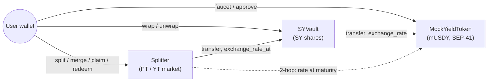

# stellas-core — PT/YT Yield Splitting on Stellar

**The missing fixed-income primitive for Stellar's RWA boom.** stellas-core splits a
yield-bearing token into two tradable parts — a **Principal Token (PT)**, redeemable 1:1 for the
underlying at maturity (a zero-coupon bond / fixed rate), and a **Yield Token (YT)**, which
receives all the yield until maturity (pure yield exposure). On Ethereum, Pendle turned this into
the backbone of on-chain fixed income; Stellar has no equivalent. This is that primitive, on
**Testnet**, as the **Orange Belt (Level 3)** submission for the Stellar *Journey to Mastery*.

> **Testnet only.** No mainnet config. Signing happens only inside your wallet — this app never
> sees your secret key.

- **Live demo:** _(deploy to Vercel and paste the URL here)_
- **Demo video:** _(record and link at the Level 3 submission checkpoint)_

## The three contracts

stellas-core is three Soroban contracts that call each other — inter-contract communication is
intrinsic to the design, not bolted on:

1. **MockYieldToken (mUSDY)** — a demo yield-bearing token (simulating USDY / a Blend position).
   Balances are fixed; an **exchange rate grows linearly with ledger time**, checkpointed so any
   past rate is recoverable exactly. Implements the full SEP-41 token interface + a public faucet.
2. **SYVault** — wraps mUSDY into **Standardized Yield (SY)** shares 1:1, with a `transfer` entry
   point so the Splitter can move SY cross-contract. Delegates its exchange rate to mUSDY.
3. **Splitter** — for a chosen maturity `T`: `split(SY) → PT + YT`, `merge(PT+YT) → SY`,
   `claim_yield(YT) → accrued yield`, `redeem_pt(PT) → fixed principal` at/after maturity.



### Inter-contract call inventory

| # | Caller → Callee | Call | When |
|---|---|---|---|
| 1 | SYVault → MockYieldToken | `transfer` (user → vault) | `wrap` |
| 2 | SYVault → MockYieldToken | `transfer` (vault → user) | `unwrap` |
| 3 | SYVault → MockYieldToken | `exchange_rate` / `exchange_rate_at` | rate views |
| 4 | Splitter → SYVault | `transfer` (user → splitter, nested auth, one signature) | `split` |
| 5 | Splitter → SYVault | `transfer` (splitter → user, invoker auth) | `merge`, `claim_yield`, `redeem_pt` |
| 6 | Splitter → SYVault → MockYieldToken | `exchange_rate_at(min(now, T))` — **two-hop chain** | every settle |

## Deployed on Testnet

| Contract | ID |
|---|---|
| MockYieldToken (mUSDY) | `CCJ53CNTNHS3AQJR54QFU6N3CVN7WA54JOVKHE7O2PBSVDEZD5TJD6NF` |
| SYVault | `CAJBU37EJTL37N4IL63WUQFUC5MHK4VBSAIXDGNE52OGSUQQ2E47UGKO` |
| Splitter | `CA2ENFLBAFF2F4PFPLUR5M5CUYIFXCLMCO4AYWA6AP3BZ4FSLBENYQNS` |

**Verifiable contract-call transactions** (Stellar Expert, Testnet):

- **Split** (cross-contract: Splitter pulls SY from SYVault, mints PT/YT) — [`f1e00efc…2965`](https://stellar.expert/explorer/testnet/tx/f1e00efc3e5bd79907a2acb791e66dcf36926ca8cca615f2b9378f1da4b42965)
- **Wrap** (SYVault ← mUSDY) — [`e3a3bfbe…4f0e`](https://stellar.expert/explorer/testnet/tx/e3a3bfbecf7c9207b84e096d6c49077fd932afe7e3bd6c2c8f9208b3212c4f0e)
- **Faucet** (mUSDY) — [`c0e064e4…95ee`](https://stellar.expert/explorer/testnet/tx/c0e064e4d5b7ade3b0054894b1a9b025276266b592825aec48d816623f5795ee)

> **Testnet resets periodically.** If a contract ID no longer resolves, redeploy with
> `./scripts/deploy-testnet.sh` and update `.env` / Vercel env vars.

## Protocol mechanics

**Reserve accounting.** PT and YT are internal, non-transferable per-`(user, maturity)` balances in
this v0 (transferable tokens + an AMM are a later belt). Since they only change together
pre-maturity, `pt == yt` per position, so yield is accounted with a simple per-user reserve instead
of a global index:

> For a position holding `yt` principal units, the protocol reserves
> `reserve_sy = ceil(yt · RATE_SCALE / R)` SY to back the principal at exchange rate `R`. As `R`
> grows, the required reserve shrinks — and **the released difference is the yield**, moved to the
> position's claimable balance on every settle. This is the Pendle mechanism expressed as a reserve
> delta, exact under integer math.

**Rounding law.** Every amount that *leaves* the protocol is rounded **down** (floor); every amount
*reserved* against a liability is rounded **up** (ceil). Consequence: the SY the contract holds is
always `≥ Σ reserve_sy + Σ accrued_sy` — there is never mintable dust. A solvency invariant test
asserts exactly this after every operation in a scripted lifecycle.

**Invariants** (enforced + tested):
- `PT_supply == YT_supply` for a maturity, through all pre-maturity operations.
- `split` then immediate `merge` of *n* SY returns *n* minus at most 2 stroops (one floor each way).
- YT stops accruing exactly at maturity; PT then redeems its fixed principal at the frozen maturity
  rate. (Post-maturity, `redeem` burns PT while YT stays inert — the `PT == YT` equality is a
  *pre-maturity* invariant, by design.)

## Tech stack

- **Contracts:** Rust + [`soroban-sdk`](https://crates.io/crates/soroban-sdk) `27.0.0`, built &
  deployed with the `stellar` CLI `27.0.0`. A Cargo workspace of three crates under `contracts/`.
- **Frontend:** [Vite](https://vite.dev/) + React 19 + TypeScript (strict), [Tailwind CSS](https://tailwindcss.com/).
- **Wallet:** [`@creit.tech/stellar-wallets-kit`](https://github.com/Creit-Tech/Stellar-Wallets-Kit)
  (multi-wallet picker) behind a thin adapter.
- **Chain:** [`@stellar/stellar-sdk`](https://github.com/stellar/js-stellar-sdk) — the official
  `contract` Client/AssembledTransaction pipeline (build → simulate → sign → send → poll), plus
  `/rpc` `getEvents` for the live activity feed.
- **Tests:** Rust unit + integration (39), [Vitest](https://vitest.dev/) for the frontend (27).
- **CI:** GitHub Actions (`.github/workflows/ci.yml`).

## Setup / run locally

A deployment is already live on Testnet (IDs are baked in as defaults), so the frontend runs with
zero config.

```bash
git clone <repository-url>
cd stellas20
npm install
cp .env.example .env   # optional — defaults already point at the live deployment
npm run dev            # http://localhost:5173
```

**Scripts:**

| Command | Description |
| --- | --- |
| `npm run dev` / `build` / `preview` | Vite dev server / production build / preview |
| `npm run lint` | ESLint |
| `npm run test` | Vitest (frontend unit tests) |
| `cargo test --workspace` | All Rust contract tests |
| `stellar contract build` | Build all contracts to WASM |

## Testing

- **Contracts — 39 Rust tests.** `cargo test --workspace`
  - `mock-yield-token` (12): SEP-41 behavior, faucet cap, linear rate growth, checkpoint history.
  - `sy-vault` (9): 1:1 wrap/unwrap with cross-contract token moves, rate delegation.
  - `splitter` (15 unit + 3 integration): split/merge/claim/redeem with hand-computed exact values,
    the `PT == YT` and yield-stops-at-maturity invariants, a full mint→wrap→split→accrue→claim→
    mature→redeem lifecycle, and a **solvency sweep** asserting the no-dust invariant after each step.
- **Frontend — 27 Vitest tests.** `npm run test` — amount math, input validation, the client-side
  yield math (mirroring the contract), per-contract error mapping, and event parsing from ScVal
  fixtures.

## CI/CD

`.github/workflows/ci.yml` runs on every push and PR:

- **contracts** job: `cargo fmt --check`, `cargo clippy -D warnings`, `cargo test --workspace`,
  then `stellar contract build` (uploads the WASM artifacts).
- **frontend** job: `npm ci`, `npm run lint`, `npm run test`, `npm run build`.

The frontend is deployed to **Vercel via its GitHub integration** (auto-deploy on push to `main`).
Contract deployment is a documented local workflow — the admin key lives only in the local
`stellar keys` store, never in CI secrets.

## Deployment workflow

```bash
stellar keys generate vault-admin --network testnet --fund
./scripts/deploy-testnet.sh
# prints VITE_MYT_CONTRACT_ID / VITE_SY_VAULT_CONTRACT_ID / VITE_SPLITTER_CONTRACT_ID
```

The script builds, deploys, and initializes all three contracts in dependency order and creates a
demo maturity. Paste the printed IDs into `.env`, `.env.example`, and your Vercel project's
environment variables.

## Error handling

Every service normalizes failures into a friendly `AppError`; cards render exactly one of
loading / error+retry / empty / content, and a wrong-network banner blocks writes off Testnet.
Distinct, visibly-handled error types include:

| Trigger | What the UI shows |
|---|---|
| Wallet not available / not installed | The picker marks it with an install link |
| User declines a signature | The action quietly returns to idle |
| Insufficient balance | Inline form error; the button disables |
| Faucet cap exceeded, maturity passed/not reached, nothing to claim, … | The contract's `#[contracterror]` mapped to a specific message |
| Wrong network | A blocking banner; writes disabled |

## How to use

1. **Connect** a Testnet wallet (Freighter, xBull, or Albedo).
2. **Faucet** 1,000 mUSDY, then **Wrap** it into SY.
3. **Split** SY at a maturity → equal PT and YT (supplies always match — an on-chain invariant).
4. Watch **claimable yield tick up live**, and **Claim** it as SY.
5. After maturity, **Redeem PT** for its fixed principal.
6. The **Activity feed** streams every protocol event across all three contracts in real time.

## Demo video script (1–2 min)

Problem (no fixed income on Stellar; PT = bond, YT = coupon) → faucet + wrap → split (equal PT/YT,
invariant) → live accrual + claim → maturity countdown hits zero, accrual freezes → redeem PT for
fixed principal → flash the green CI run and test counts (39 Rust / 27 Vitest).

## Screenshots

Deferred to the Level 3 submission checkpoint. Capture and add here: the app (desktop + 375px
mobile), a green CI run, `cargo test --workspace` output, and `npm run test` output.

## Security & notes

- **Testnet only**, by design — no mainnet configuration.
- **Keys stay in your wallet.** The app never requests, stores, or logs secrets.
- **No admin backdoor into user funds.** `withdraw`/`unwrap`/`merge`/`claim`/`redeem` only ever pay
  the caller that authorized the call, from their own recorded balance.
- **No secrets in the repo.** `.env` is gitignored; only non-secret `VITE_`-prefixed values ship to
  the client, and the contract IDs are public Testnet addresses.
