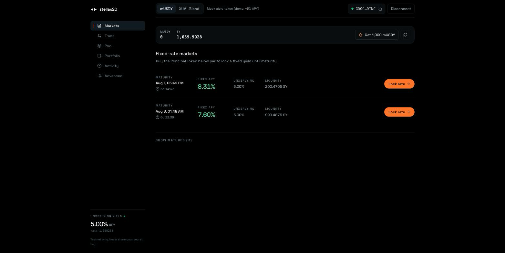
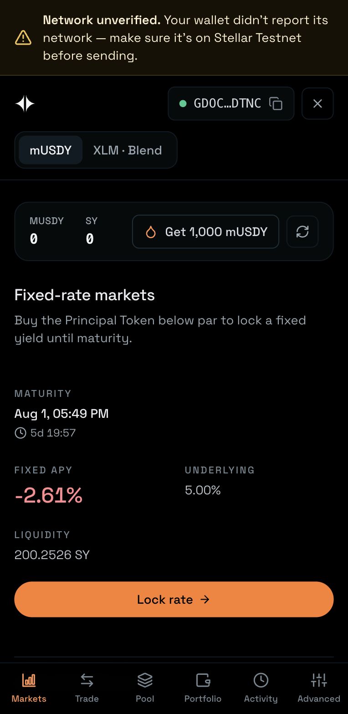
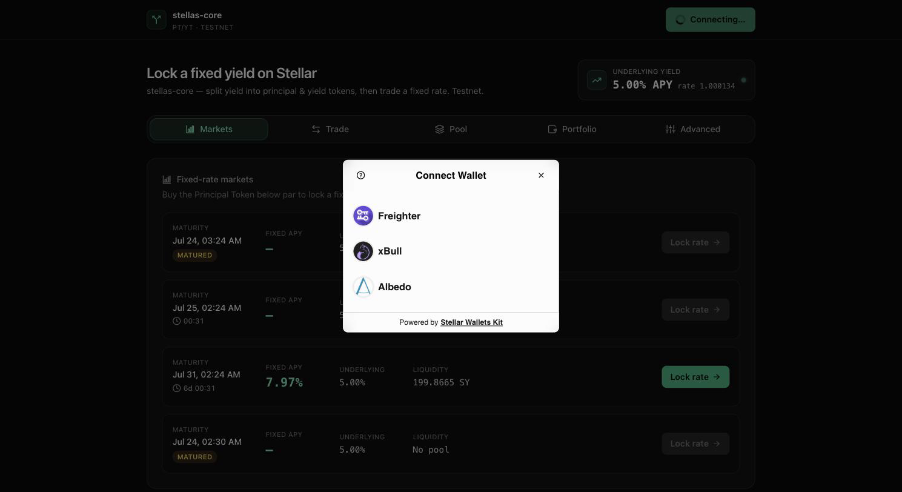
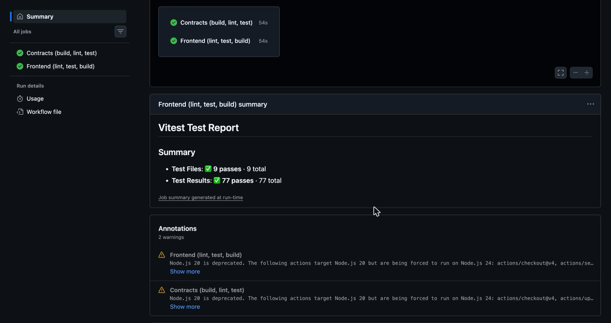

# Everspan — PT/YT Yield Splitting on Stellar

[](https://github.com/sayweer/stellas20/actions/workflows/ci.yml)

**The missing fixed-income primitive for Stellar's RWA boom.** Everspan splits a
yield-bearing token into two tradable parts — a **Principal Token (PT)**, redeemable 1:1 for the
underlying at maturity (a zero-coupon bond / fixed rate), and a **Yield Token (YT)**, which
receives all the yield until maturity (pure yield exposure). On Ethereum, Pendle turned this into
the backbone of on-chain fixed income; Stellar has no equivalent. This is that primitive, on
**Testnet**, as the **Green Belt (Level 4)** submission for the Stellar *Journey to Mastery*
(Orange Belt, Level 3, was approved on the same codebase).

> **Testnet only.** No mainnet config. Signing happens only inside your wallet — this app never
> sees your secret key.

| | |
|---|---|
| **Live demo** | [stellas20.vercel.app](https://stellas20.vercel.app/) |
| **Demo video** | [2-minute walkthrough](https://youtu.be/G_06mT7pscw) |
| **Network** | Stellar Testnet — seven contracts, addresses [below](#deployed-on-testnet) |

[](https://stellas20.vercel.app/app)

## Reviewing this repository — start here

Everything below is in this public repo. These are direct links to the files that carry the
mandatory evidence, so nothing has to be hunted for:

| To verify | Open |
|---|---|
| **Smart contract source** (7 crates) | [`contracts/`](https://github.com/sayweer/stellas20/tree/main/contracts) — [splitter](https://github.com/sayweer/stellas20/blob/main/contracts/splitter/src/lib.rs) · [pt-amm](https://github.com/sayweer/stellas20/blob/main/contracts/pt-amm/src/lib.rs) · [sy-vault](https://github.com/sayweer/stellas20/blob/main/contracts/sy-vault/src/lib.rs) · [sy-vault-blend](https://github.com/sayweer/stellas20/blob/main/contracts/sy-vault-blend/src/lib.rs) · [pt-token](https://github.com/sayweer/stellas20/blob/main/contracts/pt-token/src/lib.rs) · [yt-token](https://github.com/sayweer/stellas20/blob/main/contracts/yt-token/src/lib.rs) · [mock-yield-token](https://github.com/sayweer/stellas20/blob/main/contracts/mock-yield-token/src/lib.rs) |
| **CI/CD workflow** | [`.github/workflows/ci.yml`](https://github.com/sayweer/stellas20/blob/main/.github/workflows/ci.yml) |
| **Frontend ↔ contract integration** | [`src/lib/contracts/`](https://github.com/sayweer/stellas20/tree/main/src/lib/contracts) — [base.ts](https://github.com/sayweer/stellas20/blob/main/src/lib/contracts/base.ts) (build → simulate → sign → send → poll), [errors.ts](https://github.com/sayweer/stellas20/blob/main/src/lib/contracts/errors.ts) |
| **Wallet integration** | [`src/lib/wallet.ts`](https://github.com/sayweer/stellas20/blob/main/src/lib/wallet.ts) (StellarWalletsKit adapter) |
| **Event streaming** | [`src/lib/events.ts`](https://github.com/sayweer/stellas20/blob/main/src/lib/events.ts) (`getEvents` polling) |
| **Contract tests** | [`contracts/splitter/src/test.rs`](https://github.com/sayweer/stellas20/blob/main/contracts/splitter/src/test.rs) · [`test_lifecycle.rs`](https://github.com/sayweer/stellas20/blob/main/contracts/splitter/src/test_lifecycle.rs) |
| **On-chain proof** | [transactions below](#deployed-on-testnet) — every one a signed Testnet call |

## Where each requirement is met

| Requirement | Where | In short |
|---|---|---|
| Production deployment | [stellas20.vercel.app](https://stellas20.vercel.app/) | Vercel, auto-deployed from `main`; contracts live on Testnet |
| Monitoring & analytics | [`docs/USERS_AND_FEEDBACK.md`](docs/USERS_AND_FEEDBACK.md) | Vercel Analytics for traffic, Sentry for unclassified runtime errors |
| Feedback collection | *Feedback* link in the app header | A Google Form, wired through `VITE_FEEDBACK_FORM_URL` |
| Real users & feedback summary | [`docs/USERS_AND_FEEDBACK.md`](docs/USERS_AND_FEEDBACK.md) | 32 visitors, 16 form responses, what they asked for, and the six fixes that shipped because of them |
| Wallet interaction, proven | [`docs/USERS_AND_FEEDBACK.md`](docs/USERS_AND_FEEDBACK.md#wallet-interaction-verified-on-chain) | All fourteen wallets respondents submitted, each checked against Horizon — six with successful contract invocations |
| 15+ meaningful commits | `git log` | 100+ commits, one logical unit each |
| Public repo & documentation | this file, [`docs/`](docs/) | Architecture, threat model, runbooks, verifiable on-chain transactions |
| Advanced smart contracts | [`contracts/`](contracts/), [`docs/ARCHITECTURE.md`](docs/ARCHITECTURE.md) | Tokenized PT/YT with Pendle-style user-index accounting, a factory that deploys a SEP-41 token pair per maturity, and a constant-product AMM |
| Inter-contract communication | [`docs/ARCHITECTURE.md`](docs/ARCHITECTURE.md#inter-contract-call-inventory) | 14 distinct cross-contract calls, including a two-hop rate chain and a re-entrancy-safe settlement callback |
| Event streaming & real-time updates | [`src/lib/events.ts`](src/lib/events.ts), Activity tab | `getEvents` polling every 5s, deduped by cursor; reads refresh in the background off each new event |
| CI/CD pipeline | [`.github/workflows/ci.yml`](.github/workflows/ci.yml) | fmt · clippy `-D warnings` · contract tests · wasm build, and lint · test · build for the frontend; Vercel deploys on push |
| Deployment workflow | [`scripts/`](scripts/), [`docs/DEPLOYMENT.md`](docs/DEPLOYMENT.md) | One script deploys in dependency order with constructor init; a second seeds a pool at a target APY |
| Mobile responsive | [screenshot](#screenshots) | Responsive to 390px; the left rail becomes a bottom bar, market rows re-flow to a two-column grid |
| Error handling & loading states | [table below](#error-handling) | Every contract's `#[contracterror]` mapped to a specific message; one of loading / error+retry / empty / content, never two at once |
| Tests, contracts and frontend | [`docs/TESTING.md`](docs/TESTING.md) | 130 Rust tests including randomized invariant harnesses, 81 Vitest tests |
| Production-ready architecture | [`docs/THREAT_MODEL.md`](docs/THREAT_MODEL.md) | Threat model, two adversarial audit rounds with findings closed, no upgrade key or pause switch by design |
| Documentation & demo | this file, [video](https://youtu.be/G_06mT7pscw) | Architecture diagrams, verifiable on-chain transactions, a recorded walkthrough |

## The contracts

Seven Soroban crates under [`contracts/`](contracts/), plus a factory-deployed PT/YT token pair
per maturity — inter-contract communication is intrinsic to the design, not bolted on:

| Contract | Role |
|---|---|
| **MockYieldToken (mUSDY)** | Demo yield-bearing token; an exchange rate that grows with ledger time (~5% APY), checkpointed so any past rate is recoverable exactly. SEP-41 + public faucet. |
| **SYVault** | Wraps mUSDY into **Standardized Yield (SY)** 1:1. SY is a full SEP-41 token, so the Market moves it like any other. |
| **Splitter (the Market)** | For a maturity `T`: `split(SY) → PT + YT`, `merge`, `claim_yield`, `redeem_pt`. `create_maturity` **factory-deploys** that maturity's token pair. |
| **PT Token / YT Token** | Real, transferable SEP-41 tokens minted only by the Market; the YT carries the settlement hook. |
| **PT-AMM** | Constant-product PT/SY pools, 30 bps LP fee. **Where the fixed rate becomes real:** PT trades at a discount, so buying PT locks `(1/cost)^(YEAR/Δt) − 1` APY until maturity. |
| **SYVaultBlend** | The same SY interface over a **real [Blend](https://blend.capital) lending position** — the Market and AMM run over it unchanged. |

**Full detail — diagrams, the 14-call inter-contract inventory, the two markets, the user-index
accounting, the rounding law and the invariants — is in
[`docs/ARCHITECTURE.md`](docs/ARCHITECTURE.md).**

## Deployed on Testnet

| Contract | ID |
|---|---|
| MockYieldToken (mUSDY) | `CDN42W36GJ2AGPWGDMEL2BUEKCGCVCQ4GRLFXUBPTQUDIEDWQQHZG3TR` |
| SYVault | `CBPCPCDCHGAJUU7BID7DOOKBTIWTRIYYZXGL2YBMJ64KNR53YJD4ANZE` |
| Splitter (the Market) | `CCBQ4PWTSBKL6RTSL5CFUPVX3SZMLODDJKGH6XFVRZU6UPFXAHHZBSBR` |
| PT-AMM | `CD4B2YYEMDDRVOFH6EWIXFMP5ZX3YCLMALTYRTGSHCNXDDV3XWNIMILD` |

Per-maturity PT/YT token addresses are factory-deployed — read them via
`get_market(maturity)` or the `MaturityCreated` events.

**Blend market** (a second, independent deployment over real lending yield — switch to it with
the *XLM · Blend* toggle at the top of the app):

| Contract | ID |
|---|---|
| SYVaultBlend (`SY-bXLM`) | `CAWXCCBE7RY26LVVWN5QWWOARGDABGQKJMWAYPCM52TT5QZM2UCOGA7J` |
| Splitter (Blend Market) | `CDRDDE3NQAY5RPQ4KN7MRAOUTJTWITWLSZQWAFP4XRIN23VG7UHE6YOU` |
| PT-AMM (Blend pools) | `CBT5RSS37MYLQYEBOYM4GKWSY2MWKQW3RPUPRKQHUVZNKXLZ76TJED75` |
| Blend v2 pool (external) | `CCEBVDYM32YNYCVNRXQKDFFPISJJCV557CDZEIRBEE4NCV4KHPQ44HGF` |
| XLM (native SAC, the underlying) | `CDLZFC3SYJYDZT7K67VZ75HPJVIEUVNIXF47ZG2FB2RMQQVU2HHGCYSC` |

**Verifiable contract-call transactions** (Stellar Expert, Testnet):

- **Split** (Market pulls SY cross-contract, mints PT + YT tokens) — [`b4b424ef…a34b`](https://stellar.expert/explorer/testnet/tx/b4b424ef7fa2a3643a4b1bc4642aca6944623502858a0d20d1ff292d68eca34b)
- **YT transfer** (settlement hook: YT → Market settles both parties mid-accrual) — [`33086cb1…004e`](https://stellar.expert/explorer/testnet/tx/33086cb102d4a32c669864745c199f73268e4faca16025f798fc5f311b79004e)
- **Claim yield** (23 stroops over ~140s — exactly 5% APY on 100 SY, not a simulated number) — [`e52f407e…7416`](https://stellar.expert/explorer/testnet/tx/e52f407eaec934d4866a931da76b6ca4b846e1777c7373124c8b4166dd1a7416)
- **Redeem PT** (fixed principal at the frozen maturity rate) — [`8dd35c7e…9d49`](https://stellar.expert/explorer/testnet/tx/8dd35c7ecc09ec38aee4939402e6c03315b8b67166456e45d0dc03fd92a49d49)
- **AMM swap SY→PT** (buying PT at a discount = locking a fixed rate; `quote_swap` returned 399418091 and execution paid 399418091 — equal to the stroop) — [`bbd9fe91…f0f2`](https://stellar.expert/explorer/testnet/tx/bbd9fe9164cb20259c1a963e9941c5761473d91c6a073cafff427f1aa614f0f2)
- **AMM swap PT→SY** (the reverse leg: 5 SY → 3.994 PT → 4.976 SY, so a round trip pays both 30 bps fees and never profits) — [`967c365d…398d`](https://stellar.expert/explorer/testnet/tx/967c365d3df618cf6458ad3ef09dac6329628807110b5fbae592eda26376398d)
- **Blend wrap** (SYVaultBlend supplies 50 XLM into the live Blend pool, mints 30.9125511 SY-bXLM — not 1:1, because shares are bTokens) — [`45c99fd4…f037`](https://stellar.expert/explorer/testnet/tx/45c99fd4c54a72a7b6bcf345766c3ac62530ac13a7d6e3d20871fa5ff03ff037)
- **Blend claim** (422 stroops paid out of *Blend's own accrual*, not a simulated rate) — [`fe3f63b9…2fea`](https://stellar.expert/explorer/testnet/tx/fe3f63b963ae26b3df0b43751062c0793379a46bfca8ffa85ed2747adf452fea)
- **Blend unwrap** (0.5 SY-bXLM → 0.8087461 XLM, paid by the pool straight to the user at `b_rate` 1.617490330657) — [`e195253d…2365`](https://stellar.expert/explorer/testnet/tx/e195253d8367de5d43e38e43ef97018c56de37e90f0068dd8831ff2495b82365)

> **Testnet resets periodically.** If a contract ID no longer resolves, redeploy with
> `./scripts/deploy-testnet.sh` and update `.env` / Vercel env vars.

## Tech stack

- **Contracts:** Rust + [`soroban-sdk`](https://crates.io/crates/soroban-sdk) `27.0.0`, built &
  deployed with the `stellar` CLI `27.0.0`. A Cargo workspace of seven crates under `contracts/`
  (`mock-yield-token`, `sy-vault`, `sy-vault-blend`, `splitter`, `pt-token`, `yt-token`, `pt-amm`).
- **Frontend:** [Vite](https://vite.dev/) + React 19 + TypeScript (strict), [Tailwind CSS](https://tailwindcss.com/),
  React Router. Two surfaces: a marketing page at `/` (light, and it reads live chain state — no
  wallet needed) and the product console at `/app` (dark, six sections: Markets · Trade · Pool ·
  Portfolio · Activity · Advanced). Responsive to 390px, with the left rail collapsing to a bottom
  bar. All money math is pure, tested `bigint` in `src/lib/`.
- **Wallet:** [`@creit.tech/stellar-wallets-kit`](https://github.com/Creit-Tech/Stellar-Wallets-Kit)
  (multi-wallet picker — Freighter, xBull, LOBSTR, Albedo) behind a thin adapter. Set
  `VITE_WALLETCONNECT_PROJECT_ID` to add WalletConnect, which is what mobile browsers need — see
  [`docs/DEPLOYMENT.md`](docs/DEPLOYMENT.md#connecting-from-a-phone).
- **Chain:** [`@stellar/stellar-sdk`](https://github.com/stellar/js-stellar-sdk) — the official
  `contract` Client/AssembledTransaction pipeline (build → simulate → sign → send → poll), plus
  `/rpc` `getEvents` for the live activity feed.
- **Tests:** Rust unit + integration + a randomized invariant harness (130 passing, plus 3
  `#[ignore]` slow-tier runs, over *both* yield sources), [Vitest](https://vitest.dev/) for the
  frontend (81). Detail in [`docs/TESTING.md`](docs/TESTING.md).
- **CI:** GitHub Actions (`.github/workflows/ci.yml`), on a pinned Rust toolchain.

## Setup / run locally

A deployment is already live on Testnet (IDs are baked in as defaults), so the frontend runs with
zero config.

```bash
git clone <repository-url>
cd everspan
npm install
cp .env.example .env   # optional — defaults already point at the live deployment
npm run dev            # http://localhost:5173
```

**Scripts:**

| Command | Description |
| --- | --- |
| `npm run dev` / `build` / `preview` | Vite dev server / production build / preview |
| `npm run lint` | ESLint |
| `npm run test` | Vitest (frontend unit tests) |
| `cargo test --workspace` | All Rust contract tests |
| `stellar contract build` | Build all contracts to WASM |

## CI/CD

`.github/workflows/ci.yml` runs on every push and PR:

- **contracts** job: `cargo fmt --check`, `cargo clippy -D warnings`, `cargo test --workspace`,
  then `stellar contract build` (uploads the WASM artifacts).
- **frontend** job: `npm ci`, `npm run lint`, `npm run test`, `npm run build`.

The frontend deploys to **Vercel via its GitHub integration**, auto-deploying on every push to
`main`. Contract deployment stays a documented local workflow — the admin key lives only in the
local `stellar keys` store, never in CI secrets. Full procedure:
[`docs/DEPLOYMENT.md`](docs/DEPLOYMENT.md).

## Error handling

Every service normalizes failures into a friendly `AppError`; cards render exactly one of
loading / error+retry / empty / content, and a wrong-network banner blocks writes off Testnet.
Distinct, visibly-handled error types include:

| Trigger | What the UI shows |
|---|---|
| Wallet not available / not installed | On desktop the picker marks it with an install link; on a phone, where an extension cannot exist, it is not offered at all |
| User declines a signature | The action quietly returns to idle |
| Insufficient balance | Inline form error; the button disables |
| RPC unreachable | Named as a connection problem with a retry, not as a failed transaction — the tx may never have been sent |
| Faucet cap exceeded, maturity passed/not reached, nothing to claim, … | The contract's `#[contracterror]` mapped to a specific message |
| Blend reserve fully utilized | *"The Blend pool has no free liquidity right now"* — the pool's own error, not a generic one |
| Wrong network | A blocking banner; writes disabled |

## How to use

`/` is the marketing page; **Launch App** opens the console at `/app`. It lands on **Markets** —
one row per maturity with its implied **fixed APY**, the underlying yield APY, and pool depth
(matured maturities are collapsed out of the way). To lock a rate:

1. **Connect** a Testnet wallet (Freighter, xBull, LOBSTR, or Albedo).
2. On **Advanced**, **Faucet** 1,000 mUSDY and **Wrap** it into SY (SY is the standardized,
   yield-bearing unit everything trades against).
3. **Trade → Lock fixed rate**: buy PT with SY. The panel shows the locked APY, price impact, and
   minimum received; PT redeems 1:1 in principal at maturity, so the discount you buy at *is* your
   fixed return.
4. Or **Trade → Long yield**: split SY and sell the PT (a clearly-staged two-step flow), keeping the
   YT for pure, leveraged yield exposure.
5. **Portfolio**: watch **claimable yield tick up live**, **Claim** it as SY, and after maturity
   **Redeem PT** for its fixed principal. Manage **liquidity positions** here too.
6. **Pool**: provide PT + SY liquidity and earn the 30 bps swap fee.
7. **Activity**: streams every protocol *and* AMM event across all contracts in real time, polled
   from `getEvents`.

## Screenshots

| **Mobile — 390px** | **Multi-wallet picker** |
|---|---|
|  |  |

The traffic and error panels the checklist asks for are in
[`docs/USERS_AND_FEEDBACK.md`](docs/USERS_AND_FEEDBACK.md), next to what they are wired to.

**CI and test output** — both jobs green, with the contract suite and the Vitest summary in the log:



The [demo video](https://youtu.be/G_06mT7pscw) walks the full flow end to end: locking a fixed rate, splitting SY, watching
yield accrue, and claiming it — every step a signed Testnet transaction.

## Security & notes

Written up in full: **[`docs/THREAT_MODEL.md`](docs/THREAT_MODEL.md)** (assets, actors, trust
boundaries, the complete admin-powers inventory, failure modes) and
**[`docs/plan/audit-round-2.md`](docs/plan/audit-round-2.md)** (the adversarial review's
findings, with the storage/TTL audit and the candidates that were dismissed on inspection).
Operational procedures are in **[`docs/RUNBOOKS.md`](docs/RUNBOOKS.md)**.

- **Testnet only**, by design — no mainnet configuration.
- **Keys stay in your wallet.** The app never requests, stores, or logs secrets.
- **No admin backdoor into user funds.** `withdraw`/`unwrap`/`merge`/`claim`/`redeem` only ever pay
  the caller that authorized the call, from their own recorded balance. Exactly four entry points
  in the whole workspace are admin-gated (mint and set_rate on the demo token, create_maturity,
  create_pool); the two vaults holding real deposits have none at all.
- **No upgrade path, no pause switch, no admin rotation** — anywhere. An upgrade key is a backdoor,
  so there isn't one. The cost is stated plainly in the threat model: a bug cannot be patched in
  place, and a lost admin key permanently stops *operations* while leaving every user's ability to
  claim, redeem and exit completely intact.
- **No secrets in the repo.** `.env` is gitignored; only non-secret `VITE_`-prefixed values ship to
  the client, and the contract IDs are public Testnet addresses.

## Documentation

| Document | Contents |
|---|---|
| [`docs/ARCHITECTURE.md`](docs/ARCHITECTURE.md) | The contracts, diagrams, the 14-call inter-contract inventory, both yield sources, user-index accounting, rounding law, invariants |
| [`docs/TESTING.md`](docs/TESTING.md) | All 211 tests, per crate, plus the slow adversarial invariant tier |
| [`docs/USERS_AND_FEEDBACK.md`](docs/USERS_AND_FEEDBACK.md) | Monitoring/analytics/feedback wiring, real user results, and every submitted wallet verified against Horizon |
| [`docs/DEPLOYMENT.md`](docs/DEPLOYMENT.md) | Deploy scripts end to end, and reaching a wallet from a phone |
| [`docs/THREAT_MODEL.md`](docs/THREAT_MODEL.md) | Assets, actors, trust boundaries, admin powers, failure modes |
| [`docs/RUNBOOKS.md`](docs/RUNBOOKS.md) | Operational procedures |
| [`docs/plan/audit-round-2.md`](docs/plan/audit-round-2.md) | Adversarial audit findings and the storage/TTL review |
