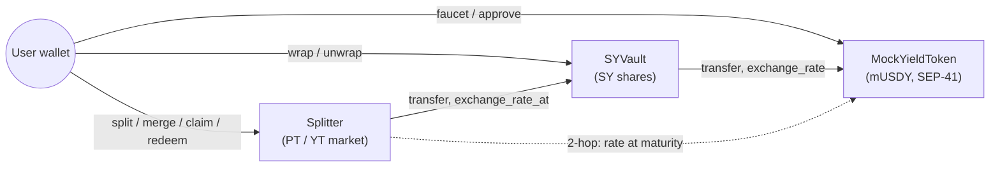

# stellas-core — PT/YT Yield Splitting on Stellar

**The missing fixed-income primitive for Stellar's RWA boom.** stellas-core splits a
yield-bearing token into two tradable parts — a **Principal Token (PT)**, redeemable 1:1 for the
underlying at maturity (a zero-coupon bond / fixed rate), and a **Yield Token (YT)**, which
receives all the yield until maturity (pure yield exposure). On Ethereum, Pendle turned this into
the backbone of on-chain fixed income; Stellar has no equivalent. This is that primitive, on
**Testnet**, as the **Orange Belt (Level 3)** submission for the Stellar *Journey to Mastery*.

> **Testnet only.** No mainnet config. Signing happens only inside your wallet — this app never
> sees your secret key.

- **Live demo:** [stellas20.vercel.app](https://stellas20.vercel.app/)
- **Demo video:** _(record and link at the Level 3 submission checkpoint)_

## The contracts

stellas-core is three core Soroban contracts plus a factory-deployed PT/YT token pair per
maturity — inter-contract communication is intrinsic to the design, not bolted on:

1. **MockYieldToken (mUSDY)** — a demo yield-bearing token (simulating USDY / a Blend position).
   Balances are fixed; an **exchange rate grows with ledger time** (~5% APY by default),
   checkpointed so any past rate is recoverable exactly. Full SEP-41 + a public faucet.
2. **SYVault** — wraps mUSDY into **Standardized Yield (SY)** 1:1. SY is a full SEP-41 token
   (`SY-mUSDY`: transfer, allowances, burn, metadata), so the Market — and any future
   contract — moves it like any other token. Delegates its exchange rate to mUSDY.
3. **Splitter (the Market)** — for a chosen maturity `T`: `split(SY) → PT + YT`,
   `merge(PT+YT) → SY`, `claim_yield(YT) → accrued yield`, `redeem_pt(PT) → fixed principal`
   at/after maturity. `create_maturity` **factory-deploys** that maturity's token pair:
4. **PT Token / YT Token** (`PT-mUSDY-<T>` / `YT-mUSDY-<T>`) — real, transferable SEP-41
   tokens, minted only by the Market; the YT carries the settlement hook described below.
5. **PT-AMM** — constant-product PT/SY pools (one per maturity, 30 bps LP fee, Uniswap-V2
   math with the first-mint MINIMUM_LIQUIDITY lock). **This is where the fixed rate becomes
   real:** PT trades at a discount, so buying PT = locking
   `(1/cost)^(YEAR/Δt) − 1` APY until maturity. Swaps and deposits freeze at maturity;
   LP withdrawal always works.



### Inter-contract call inventory

| # | Caller → Callee | Call | When |
|---|---|---|---|
| 1 | SYVault → MockYieldToken | `transfer` (user → vault) | `wrap` |
| 2 | SYVault → MockYieldToken | `transfer` (vault → user) | `unwrap` |
| 3 | SYVault → MockYieldToken | `exchange_rate` / `exchange_rate_at` | rate views |
| 4 | Splitter → SYVault | `transfer` (user → splitter, nested auth, one signature) | `split` |
| 5 | Splitter → SYVault | `transfer` (splitter → user, invoker auth) | `merge`, `claim_yield`, `redeem_pt` |
| 6 | Splitter → SYVault → MockYieldToken | `exchange_rate_at(min(now, T))` — **two-hop chain** | every settle |

## Deployed on Testnet

| Contract | ID |
|---|---|
| MockYieldToken (mUSDY) | `CDQT4AHF5JLEQ2CXFXNBAGMTIJLS2UIEYCHQ6NICKBT5TFW54YI5IANU` |
| SYVault | `CDXY2JXPIBQMSTOTK62JLWT4HULABSBX7BQCFCWOFYUKWXZY6EIVA5OJ` |
| Splitter (the Market) | `CARHO56HXKHT5FYBD7R7N2FPE5UFEMEXI3WYA4KV3ILR73PCZYBCZVNU` |
| PT-AMM | `CAQHWGN6XRZ2X77TE634LRIQTYNISU6BXJFDPFSKREA473NJUA5MG5J4` |

Per-maturity PT/YT token addresses are factory-deployed — read them via
`get_market(maturity)` or the `MaturityCreated` events.

**Verifiable contract-call transactions** (Stellar Expert, Testnet):

- **Split** (Market pulls SY cross-contract, mints PT + YT tokens) — [`325a90dd…a898`](https://stellar.expert/explorer/testnet/tx/325a90dde67dbd3848d2f3b60532396dfdc3a64b157546b537f39634e672a898)
- **YT transfer** (settlement hook: YT → Market settles both parties mid-accrual) — [`e0645064…a46c`](https://stellar.expert/explorer/testnet/tx/e0645064fd1e351092c9c9b421468421650c34c88ad38377bb20d095b640a46c)
- **Claim yield** (the transfer's *recipient* wallet claims its own rate window) — [`aa1e505e…c089`](https://stellar.expert/explorer/testnet/tx/aa1e505ebd74a005175e2f0d079dfb4c78407622b406ea9fda3cc2c3cb1dc089)
- **Redeem PT** (fixed principal at the frozen maturity rate) — [`76e64ced…e32a`](https://stellar.expert/explorer/testnet/tx/76e64ced07b63e4435997dee539b19d1a0095a4800c91b5804b958b07bafe32a)
- **AMM swap SY→PT** (buying PT at a discount = locking a fixed rate; quote matched execution to the stroop) — [`04551d54…727a`](https://stellar.expert/explorer/testnet/tx/04551d54e62a51c122a10216bf7414cb0e8baeb95cf453acc3e221f02eda727a)
- **AMM swap PT→SY** (the reverse leg on the same pool) — [`4469da59…1004`](https://stellar.expert/explorer/testnet/tx/4469da5997a0ff852a9433eb409ca6533193b667a98bb984f9a6e5d589b81004)

> **Testnet resets periodically.** If a contract ID no longer resolves, redeploy with
> `./scripts/deploy-testnet.sh` and update `.env` / Vercel env vars.

## Protocol mechanics

**Tokenized PT/YT with user-index accounting.** PT and YT are real SEP-41 tokens — one pair per
maturity, factory-deployed by the Market (`create_maturity` → `deploy_v2` with a deterministic
salt, constructor-wired to the Market as sole minter; symbols `PT-mUSDY-<T>` / `YT-mUSDY-<T>`).
Because YT is transferable, yield is settled per holder against a **rate index** (the Pendle
user-index mechanism):

> Each holder carries `index` — the exchange rate at their last settlement. On settle at effective
> rate `R` (frozen at `R_T` from maturity on), the holder is credited
> `released = floor(yt·S/index) − ceil(yt·S/R)`, clamped ≥ 0, and `index := R`. Entitlements
> floor, retained backing ceils — no settlement can overpay the real released yield.

**The YT settlement hook.** Every user-initiated YT balance change (`transfer`, `transfer_from`,
`burn`, `burn_from`) first calls `Market.on_yt_transfer` with the **pre-change balances as
arguments**, settling both parties — sender keeps the yield accrued up to that moment, receiver
starts earning from it. Balances travel as arguments because Soroban forbids the Market reading
`YT.balance()` back while YT is mid-call (reentrancy ban); authenticity comes from the factory
registry plus `require_auth()`, which only the genuine YT contract passes as direct invoker.
`mint`/`market_burn` are hook-free (the Market settles internally first); `market_burn` demands
both the Market's and the holder's auth so nobody can skip settlement.

**Rounding law.** Every amount that *leaves* the protocol is rounded **down** (floor); every amount
*reserved* against a liability is rounded **up** (ceil). Consequence: the SY the contract holds is
always `≥ Σ reserve_sy + Σ accrued_sy` — there is never mintable dust. A solvency invariant test
asserts exactly this after every operation in a scripted lifecycle.

**Invariants** (enforced + tested):
- `PT_supply == YT_supply` for a maturity, through all pre-maturity operations.
- `split` then immediate `merge` of *n* SY returns *n* minus at most 2 stroops (one floor each way).
- YT stops accruing exactly at maturity; PT then redeems its fixed principal at the frozen maturity
  rate. (Post-maturity, `redeem` burns PT while YT stays inert — the `PT == YT` equality is a
  *pre-maturity* invariant, by design.)

## Tech stack

- **Contracts:** Rust + [`soroban-sdk`](https://crates.io/crates/soroban-sdk) `27.0.0`, built &
  deployed with the `stellar` CLI `27.0.0`. A Cargo workspace of three crates under `contracts/`.
- **Frontend:** [Vite](https://vite.dev/) + React 19 + TypeScript (strict), [Tailwind CSS](https://tailwindcss.com/).
- **Wallet:** [`@creit.tech/stellar-wallets-kit`](https://github.com/Creit-Tech/Stellar-Wallets-Kit)
  (multi-wallet picker) behind a thin adapter.
- **Chain:** [`@stellar/stellar-sdk`](https://github.com/stellar/js-stellar-sdk) — the official
  `contract` Client/AssembledTransaction pipeline (build → simulate → sign → send → poll), plus
  `/rpc` `getEvents` for the live activity feed.
- **Tests:** Rust unit + integration (53), [Vitest](https://vitest.dev/) for the frontend (35).
- **CI:** GitHub Actions (`.github/workflows/ci.yml`), on a pinned Rust toolchain.

## Setup / run locally

A deployment is already live on Testnet (IDs are baked in as defaults), so the frontend runs with
zero config.

```bash
git clone <repository-url>
cd stellas20
npm install
cp .env.example .env   # optional — defaults already point at the live deployment
npm run dev            # http://localhost:5173
```

**Scripts:**

| Command | Description |
| --- | --- |
| `npm run dev` / `build` / `preview` | Vite dev server / production build / preview |
| `npm run lint` | ESLint |
| `npm run test` | Vitest (frontend unit tests) |
| `cargo test --workspace` | All Rust contract tests |
| `stellar contract build` | Build all contracts to WASM |

## Testing

- **Contracts — 53 Rust tests.** `cargo test --workspace`
  - `mock-yield-token` (18): SEP-41 behavior, auth-gated admin ops, faucet cap, linear rate growth,
    checkpoint history, burn, and allowance expiration.
  - `sy-vault` (10): 1:1 wrap/unwrap with cross-contract token moves, transfer, rate delegation.
  - `splitter` (22 unit + 3 integration): split/merge/claim/redeem with hand-computed exact values,
    event assertions, auth-negative and edge cases (double redeem, claim-after-redeem, multi-maturity),
    the `PT == YT` and yield-stops-at-maturity invariants, a full mint→wrap→split→accrue→claim→
    mature→redeem lifecycle, and a **solvency sweep** asserting the no-dust invariant after each step.
- **Frontend — 35 Vitest tests.** `npm run test` — amount parsing (incl. the crash regression),
  input validation in stroops, the client-side yield math (mirroring the contract), chain-time
  anchoring, per-contract error mapping, and event parsing from ScVal fixtures.

## CI/CD

`.github/workflows/ci.yml` runs on every push and PR:

- **contracts** job: `cargo fmt --check`, `cargo clippy -D warnings`, `cargo test --workspace`,
  then `stellar contract build` (uploads the WASM artifacts).
- **frontend** job: `npm ci`, `npm run lint`, `npm run test`, `npm run build`.

The frontend deploys to **Vercel via its GitHub integration**: import the repo (Vite is
auto-detected, no build config needed), and once connected Vercel auto-deploys on every push to
`main`. Contract deployment stays a documented local workflow — the admin key lives only in the
local `stellar keys` store, never in CI secrets.

## Deployment workflow

```bash
stellar keys generate vault-admin --network testnet --fund
./scripts/deploy-testnet.sh
# prints VITE_MYT_CONTRACT_ID / VITE_SY_VAULT_CONTRACT_ID / VITE_SPLITTER_CONTRACT_ID
```

The script builds, deploys, and initializes all three contracts in dependency order and creates a
demo maturity. Paste the printed IDs into `.env`, `.env.example`, and your Vercel project's
environment variables.

## Error handling

Every service normalizes failures into a friendly `AppError`; cards render exactly one of
loading / error+retry / empty / content, and a wrong-network banner blocks writes off Testnet.
Distinct, visibly-handled error types include:

| Trigger | What the UI shows |
|---|---|
| Wallet not available / not installed | The picker marks it with an install link |
| User declines a signature | The action quietly returns to idle |
| Insufficient balance | Inline form error; the button disables |
| Faucet cap exceeded, maturity passed/not reached, nothing to claim, … | The contract's `#[contracterror]` mapped to a specific message |
| Wrong network | A blocking banner; writes disabled |

## How to use

1. **Connect** a Testnet wallet (Freighter, xBull, or Albedo).
2. **Faucet** 1,000 mUSDY, then **Wrap** it into SY.
3. **Split** SY at a maturity → equal PT and YT (supplies always match — an on-chain invariant).
4. Watch **claimable yield tick up live**, and **Claim** it as SY.
5. After maturity, **Redeem PT** for its fixed principal.
6. The **Activity feed** streams every protocol event across all three contracts in real time.

## Demo video script (1–2 min)

Problem (no fixed income on Stellar; PT = bond, YT = coupon) → faucet + wrap → split (equal PT/YT,
invariant) → live accrual + claim → maturity countdown hits zero, accrual freezes → redeem PT for
fixed principal → flash the green CI run and test counts (53 Rust / 35 Vitest).

## Screenshots

Deferred to the Level 3 submission checkpoint. Capture and add here: the app (desktop + 375px
mobile), a green CI run, `cargo test --workspace` output, and `npm run test` output.

## Security & notes

- **Testnet only**, by design — no mainnet configuration.
- **Keys stay in your wallet.** The app never requests, stores, or logs secrets.
- **No admin backdoor into user funds.** `withdraw`/`unwrap`/`merge`/`claim`/`redeem` only ever pay
  the caller that authorized the call, from their own recorded balance.
- **No secrets in the repo.** `.env` is gitignored; only non-secret `VITE_`-prefixed values ship to
  the client, and the contract IDs are public Testnet addresses.
