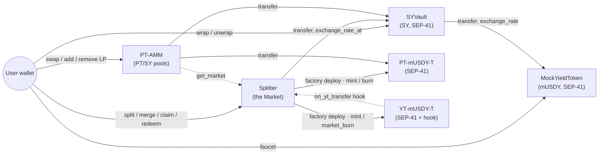
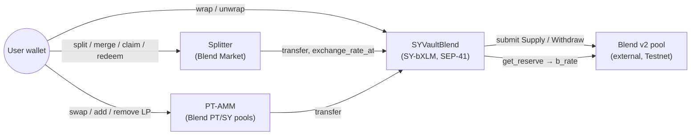
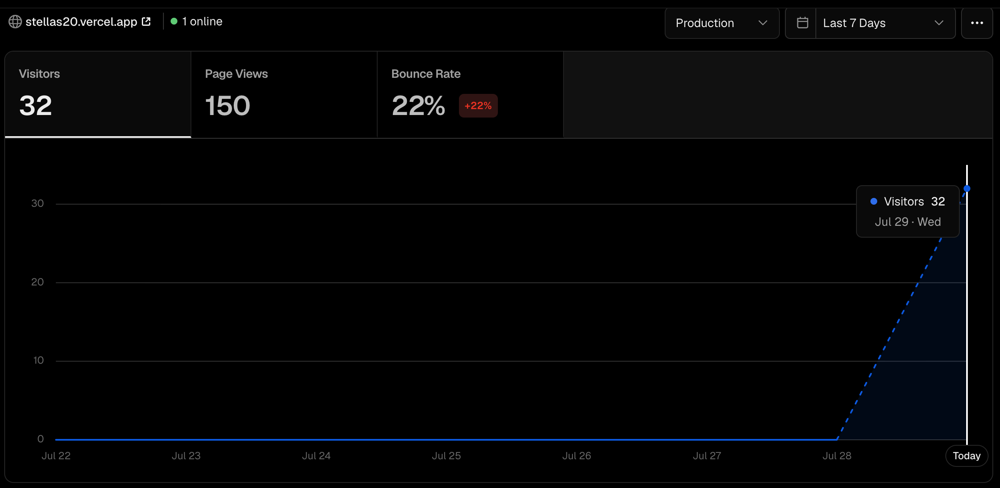
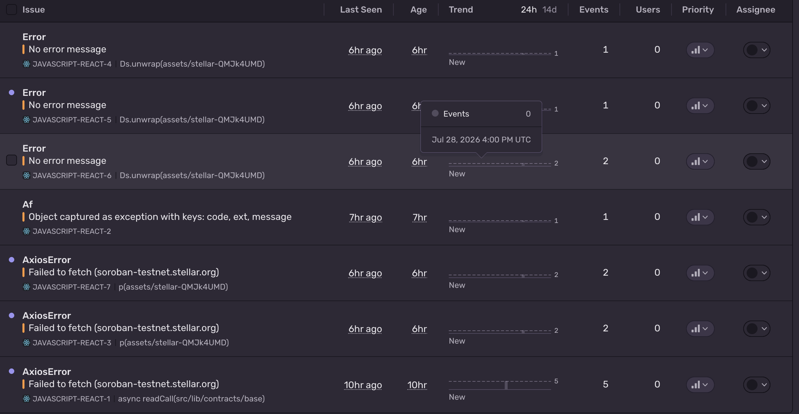

# stellas20 — PT/YT Yield Splitting on Stellar

[](https://github.com/sayweer/stellas20/actions/workflows/ci.yml)

**The missing fixed-income primitive for Stellar's RWA boom.** stellas20 splits a
yield-bearing token into two tradable parts — a **Principal Token (PT)**, redeemable 1:1 for the
underlying at maturity (a zero-coupon bond / fixed rate), and a **Yield Token (YT)**, which
receives all the yield until maturity (pure yield exposure). On Ethereum, Pendle turned this into
the backbone of on-chain fixed income; Stellar has no equivalent. This is that primitive, on
**Testnet**, as the **Green Belt (Level 4)** submission for the Stellar *Journey to Mastery*
(Orange Belt, Level 3, was approved on the same codebase).

> **Testnet only.** No mainnet config. Signing happens only inside your wallet — this app never
> sees your secret key.

| | |
|---|---|
| **Live demo** | [stellas20.vercel.app](https://stellas20.vercel.app/) |
| **Demo video** | [2-minute walkthrough](https://youtu.be/G_06mT7pscw) |
| **Network** | Stellar Testnet — seven contracts, addresses [below](#deployed-on-testnet) |

[](https://stellas20.vercel.app/app)

## Where each requirement is met

| Requirement | Where | In short |
|---|---|---|
| Production deployment | [stellas20.vercel.app](https://stellas20.vercel.app/) | Vercel, auto-deployed from `main`; contracts live on Testnet |
| Monitoring & analytics | [monitoring](#monitoring-analytics-and-feedback) | Vercel Analytics for traffic, Sentry for unclassified runtime errors |
| Feedback collection | *Feedback* link in the app header | A Google Form, wired through `VITE_FEEDBACK_FORM_URL` |
| Real users & feedback summary | [users and feedback](#users-and-feedback) | 32 visitors, 12 form responses, what they asked for and where they agree with each other |
| Wallet interaction, proven | [verified on-chain](#wallet-interaction-verified-on-chain) | Six addresses the project does not control, each with successful contract invocations on Horizon |
| 15+ meaningful commits | `git log` | 100+ commits, one logical unit each |
| Public repo & documentation | this file, [`docs/`](docs/) | Architecture, threat model, runbooks, verifiable on-chain transactions |
| Advanced smart contracts | [`contracts/`](contracts/) | Tokenized PT/YT with Pendle-style user-index accounting, a factory that deploys a SEP-41 token pair per maturity, and a constant-product AMM |
| Inter-contract communication | [inventory below](#inter-contract-call-inventory) | 14 distinct cross-contract calls, including a two-hop rate chain and a re-entrancy-safe settlement callback |
| Event streaming & real-time updates | [`src/lib/events.ts`](src/lib/events.ts), Activity tab | `getEvents` polling every 5s, deduped by cursor; reads refresh in the background off each new event |
| CI/CD pipeline | [`.github/workflows/ci.yml`](.github/workflows/ci.yml) | fmt · clippy `-D warnings` · contract tests · wasm build, and lint · test · build for the frontend; Vercel deploys on push |
| Deployment workflow | [`scripts/`](scripts/), [`docs/RUNBOOKS.md`](docs/RUNBOOKS.md) | One script deploys in dependency order with constructor init; a second seeds a pool at a target APY |
| Mobile responsive | [screenshot](#screenshots) | Responsive to 390px; the left rail becomes a bottom bar, market rows re-flow to a two-column grid |
| Error handling & loading states | [table below](#error-handling) | Every contract's `#[contracterror]` mapped to a specific message; one of loading / error+retry / empty / content, never two at once |
| Tests, contracts and frontend | [`cargo test`](#testing), [`npm test`](#testing) | 130 Rust tests including randomized invariant harnesses, 81 Vitest tests |
| Production-ready architecture | [`docs/THREAT_MODEL.md`](docs/THREAT_MODEL.md) | Threat model, two adversarial audit rounds with findings closed, no upgrade key or pause switch by design |
| Documentation & demo | this file, [video](https://youtu.be/G_06mT7pscw) | Architecture diagrams, verifiable on-chain transactions, a recorded walkthrough |

## The contracts

stellas20 is six core Soroban contracts (seven with the Blend vault) plus a factory-deployed
PT/YT token pair per maturity — inter-contract communication is intrinsic to the design, not
bolted on:

1. **MockYieldToken (mUSDY)** — a demo yield-bearing token (simulating USDY / a Blend position).
   Balances are fixed; an **exchange rate grows with ledger time** (~5% APY by default),
   checkpointed so any past rate is recoverable exactly. Full SEP-41 + a public faucet.
2. **SYVault** — wraps mUSDY into **Standardized Yield (SY)** 1:1. SY is a full SEP-41 token
   (`SY-mUSDY`: transfer, allowances, burn, metadata), so the Market — and any future
   contract — moves it like any other token. Delegates its exchange rate to mUSDY.
3. **Splitter (the Market)** — for a chosen maturity `T`: `split(SY) → PT + YT`,
   `merge(PT+YT) → SY`, `claim_yield(YT) → accrued yield`, `redeem_pt(PT) → fixed principal`
   at/after maturity. `create_maturity` **factory-deploys** that maturity's token pair:
4. **PT Token / YT Token** (`PT-mUSDY-<T>` / `YT-mUSDY-<T>`) — real, transferable SEP-41
   tokens, minted only by the Market; the YT carries the settlement hook described below.
5. **PT-AMM** — constant-product PT/SY pools (one per maturity, 30 bps LP fee, Uniswap-V2
   math with the first-mint MINIMUM_LIQUIDITY lock). **This is where the fixed rate becomes
   real:** PT trades at a discount, so buying PT = locking
   `(1/cost)^(YEAR/Δt) − 1` APY until maturity. Swaps and deposits freeze at maturity;
   LP withdrawal always works.
6. **SYVaultBlend** — the same SY interface over a **real [Blend](https://blend.capital) lending
   position** instead of the mock. See [Two markets](#two-markets-mock-and-real-yield) below: the
   SY interface *is* the adapter boundary, so the Market and the AMM run over it unchanged.



### Inter-contract call inventory

| # | Caller → Callee | Call | When |
|---|---|---|---|
| 1 | SYVault → MockYieldToken | `transfer` (user → vault) | `wrap` |
| 2 | SYVault → MockYieldToken | `transfer` (vault → user) | `unwrap` |
| 3 | SYVault → MockYieldToken | `exchange_rate` / `exchange_rate_at` | rate views |
| 4 | Splitter → SYVault | `transfer` (user → splitter, nested auth, one signature) | `split` |
| 5 | Splitter → SYVault | `transfer` (splitter → user, invoker auth) | `merge`, `claim_yield`, `redeem_pt` |
| 6 | Splitter → SYVault → MockYieldToken | `exchange_rate_at(min(now, T))` — **two-hop chain** | every settle |
| 7 | Splitter → PT/YT tokens | `deploy_v2` — **factory deploys** the maturity's token pair | `create_maturity` |
| 8 | Splitter → PT/YT tokens | `mint` / `burn` / `market_burn` | `split`, `merge`, `redeem_pt` |
| 9 | YT token → Splitter | `on_yt_transfer` — settlement **callback** with pre-change balances | every YT transfer/burn |
| 10 | PT-AMM → PT & SY tokens | `transfer` (nested auth) | `swap`, `add_liquidity`, `remove_liquidity` |
| 11 | PT-AMM → Splitter | `get_market` — resolve the maturity's PT token | `create_pool` |
| 12 | SYVaultBlend → Blend pool | `submit(Supply)` — the pool pulls the underlying from the *user* (nested auth) | `wrap` |
| 13 | SYVaultBlend → Blend pool | `submit(Withdraw)` — the pool pays the user directly; failures mapped from Blend's codes | `unwrap` |
| 14 | SYVaultBlend → Blend pool | `get_reserve` — the live `b_rate` behind `exchange_rate` | every settle on the Blend market |

## Deployed on Testnet

| Contract | ID |
|---|---|
| MockYieldToken (mUSDY) | `CDN42W36GJ2AGPWGDMEL2BUEKCGCVCQ4GRLFXUBPTQUDIEDWQQHZG3TR` |
| SYVault | `CBPCPCDCHGAJUU7BID7DOOKBTIWTRIYYZXGL2YBMJ64KNR53YJD4ANZE` |
| Splitter (the Market) | `CCBQ4PWTSBKL6RTSL5CFUPVX3SZMLODDJKGH6XFVRZU6UPFXAHHZBSBR` |
| PT-AMM | `CD4B2YYEMDDRVOFH6EWIXFMP5ZX3YCLMALTYRTGSHCNXDDV3XWNIMILD` |

Per-maturity PT/YT token addresses are factory-deployed — read them via
`get_market(maturity)` or the `MaturityCreated` events.

**Blend market** (a second, independent deployment over real lending yield — switch to it with
the *XLM · Blend* toggle at the top of the app):

| Contract | ID |
|---|---|
| SYVaultBlend (`SY-bXLM`) | `CAWXCCBE7RY26LVVWN5QWWOARGDABGQKJMWAYPCM52TT5QZM2UCOGA7J` |
| Splitter (Blend Market) | `CDRDDE3NQAY5RPQ4KN7MRAOUTJTWITWLSZQWAFP4XRIN23VG7UHE6YOU` |
| PT-AMM (Blend pools) | `CBT5RSS37MYLQYEBOYM4GKWSY2MWKQW3RPUPRKQHUVZNKXLZ76TJED75` |
| Blend v2 pool (external) | `CCEBVDYM32YNYCVNRXQKDFFPISJJCV557CDZEIRBEE4NCV4KHPQ44HGF` |
| XLM (native SAC, the underlying) | `CDLZFC3SYJYDZT7K67VZ75HPJVIEUVNIXF47ZG2FB2RMQQVU2HHGCYSC` |

**Verifiable contract-call transactions** (Stellar Expert, Testnet):

- **Split** (Market pulls SY cross-contract, mints PT + YT tokens) — [`b4b424ef…a34b`](https://stellar.expert/explorer/testnet/tx/b4b424ef7fa2a3643a4b1bc4642aca6944623502858a0d20d1ff292d68eca34b)
- **YT transfer** (settlement hook: YT → Market settles both parties mid-accrual) — [`33086cb1…004e`](https://stellar.expert/explorer/testnet/tx/33086cb102d4a32c669864745c199f73268e4faca16025f798fc5f311b79004e)
- **Claim yield** (23 stroops over ~140s — exactly 5% APY on 100 SY, not a simulated number) — [`e52f407e…7416`](https://stellar.expert/explorer/testnet/tx/e52f407eaec934d4866a931da76b6ca4b846e1777c7373124c8b4166dd1a7416)
- **Redeem PT** (fixed principal at the frozen maturity rate) — [`8dd35c7e…9d49`](https://stellar.expert/explorer/testnet/tx/8dd35c7ecc09ec38aee4939402e6c03315b8b67166456e45d0dc03fd92a49d49)
- **AMM swap SY→PT** (buying PT at a discount = locking a fixed rate; `quote_swap` returned 399418091 and execution paid 399418091 — equal to the stroop) — [`bbd9fe91…f0f2`](https://stellar.expert/explorer/testnet/tx/bbd9fe9164cb20259c1a963e9941c5761473d91c6a073cafff427f1aa614f0f2)
- **AMM swap PT→SY** (the reverse leg: 5 SY → 3.994 PT → 4.976 SY, so a round trip pays both 30 bps fees and never profits) — [`967c365d…398d`](https://stellar.expert/explorer/testnet/tx/967c365d3df618cf6458ad3ef09dac6329628807110b5fbae592eda26376398d)
- **Blend wrap** (SYVaultBlend supplies 50 XLM into the live Blend pool, mints 30.9125511 SY-bXLM — not 1:1, because shares are bTokens) — [`45c99fd4…f037`](https://stellar.expert/explorer/testnet/tx/45c99fd4c54a72a7b6bcf345766c3ac62530ac13a7d6e3d20871fa5ff03ff037)
- **Blend claim** (422 stroops paid out of *Blend's own accrual*, not a simulated rate) — [`fe3f63b9…2fea`](https://stellar.expert/explorer/testnet/tx/fe3f63b963ae26b3df0b43751062c0793379a46bfca8ffa85ed2747adf452fea)
- **Blend unwrap** (0.5 SY-bXLM → 0.8087461 XLM, paid by the pool straight to the user at `b_rate` 1.617490330657) — [`e195253d…2365`](https://stellar.expert/explorer/testnet/tx/e195253d8367de5d43e38e43ef97018c56de37e90f0068dd8831ff2495b82365)

> **Testnet resets periodically.** If a contract ID no longer resolves, redeploy with
> `./scripts/deploy-testnet.sh` and update `.env` / Vercel env vars.

## Two markets: mock and real yield

The app ships **two independent markets**, switchable from the toggle above the tabs. They share
no state and no contracts — only the PT/YT wasm:

| | **mUSDY** | **XLM · Blend** |
|---|---|---|
| Yield source | MockYieldToken, a rate that grows ~5% APY by ledger time | a live [Blend v2](https://blend.capital) lending pool on Testnet |
| SY shares | wrapped 1:1 with the underlying | **bTokens** — wrapping mints `amount / rate` shares |
| Getting the underlying | public faucet on the token | Friendbot (it is plain XLM) |
| Purpose | deterministic demo, the CI baseline | proof the mechanism works on yield nobody controls |

Per MASTERPLAN §3.7 there is **no adapter contract**: the SY interface *is* the adapter boundary,
so `SYVaultBlend` simply implements the same surface the Market already consumes
(`transfer / balance / exchange_rate / exchange_rate_at`), and the Market, the PT/YT tokens and the
AMM run over it unchanged. Two things Blend does not provide on its own are added in the vault:

- **Monotonicity.** `exchange_rate` returns Blend's live `b_rate` through a ratchet, so the rate can
  never move backwards. MASTERPLAN §3.2 makes that binding for every SY source, and the settle math
  depends on it.
- **A recoverable past.** Blend keeps no rate history, but maturity settlement needs `R_T`. A past
  timestamp **freezes at the first rate observed after it** and every later lookup returns that same
  value — so the first post-maturity settlement pins `R_T` in the transaction that reads it, and
  every later one agrees. Freezing *upward* is the safe direction: a lookup that came back lower
  than the live read at that moment would make a settlement release negative and quietly shift SY
  to PT holders. The reasoning is written up in `docs/plan/blend-notes.md`.

**Exit can genuinely fail.** A fully utilized Blend reserve cannot pay a withdrawal; the vault
catches the pool's `InvalidUtilRate` and surfaces it as its own error, so the UI says *"the Blend
pool has no free liquidity right now"* instead of a generic failure.



`blend-contract-sdk` is deliberately **not** a dependency: its latest release pins `soroban-sdk 25`
against this workspace's `27`, and two SDK majors cannot share an `Env`. The pool client is
hand-written from the deployed spec, and tests run against a mock pool that reproduces Blend's exact
rounding — which also keeps CI free of network calls.

## Protocol mechanics

**Tokenized PT/YT with user-index accounting.** PT and YT are real SEP-41 tokens — one pair per
maturity, factory-deployed by the Market (`create_maturity` → `deploy_v2` with a deterministic
salt, constructor-wired to the Market as sole minter; symbols `PT-mUSDY-<T>` / `YT-mUSDY-<T>`).
Because YT is transferable, yield is settled per holder against a **rate index** (the Pendle
user-index mechanism):

> Each holder carries `index` — the exchange rate at their last settlement. On settle at effective
> rate `R` (frozen at `R_T` from maturity on), the holder is credited
> `released = floor(yt·S/index) − ceil(yt·S/R)`, clamped ≥ 0, and `index := R`. Entitlements
> floor, retained backing ceils — no settlement can overpay the real released yield.

**The YT settlement hook.** Every user-initiated YT balance change (`transfer`, `transfer_from`,
`burn`, `burn_from`) first calls `Market.on_yt_transfer` with the **pre-change balances as
arguments**, settling both parties — sender keeps the yield accrued up to that moment, receiver
starts earning from it. Balances travel as arguments because Soroban forbids the Market reading
`YT.balance()` back while YT is mid-call (reentrancy ban); authenticity comes from the factory
registry plus `require_auth()`, which only the genuine YT contract passes as direct invoker.
`mint`/`market_burn` are hook-free (the Market settles internally first); `market_burn` demands
both the Market's and the holder's auth so nobody can skip settlement.

**Rounding law.** Every amount that *leaves* the protocol is rounded **down** (floor); every amount
*reserved* against a liability is rounded **up** (ceil). Consequence: the SY the contract holds is
always `≥ Σ reserve_sy + Σ accrued_sy` — there is never mintable dust. A solvency invariant test
asserts exactly this after every operation in a scripted lifecycle.

**Invariants** (enforced + tested):
- `PT_supply == YT_supply` for a maturity, through all pre-maturity operations.
- `split` then immediate `merge` of *n* SY returns *n* minus at most 2 stroops (one floor each way).
- YT stops accruing exactly at maturity; PT then redeems its fixed principal at the frozen maturity
  rate. (Post-maturity, `redeem` burns PT while YT stays inert — the `PT == YT` equality is a
  *pre-maturity* invariant, by design.)

## Tech stack

- **Contracts:** Rust + [`soroban-sdk`](https://crates.io/crates/soroban-sdk) `27.0.0`, built &
  deployed with the `stellar` CLI `27.0.0`. A Cargo workspace of seven crates under `contracts/`
  (`mock-yield-token`, `sy-vault`, `sy-vault-blend`, `splitter`, `pt-token`, `yt-token`, `pt-amm`).
- **Frontend:** [Vite](https://vite.dev/) + React 19 + TypeScript (strict), [Tailwind CSS](https://tailwindcss.com/),
  React Router. Two surfaces: a marketing page at `/` (light, and it reads live chain state — no
  wallet needed) and the product console at `/app` (dark, six sections: Markets · Trade · Pool ·
  Portfolio · Activity · Advanced). Responsive to 390px, with the left rail collapsing to a bottom
  bar. All money math is pure, tested `bigint` in `src/lib/`.
- **Wallet:** [`@creit.tech/stellar-wallets-kit`](https://github.com/Creit-Tech/Stellar-Wallets-Kit)
  (multi-wallet picker — Freighter, xBull, LOBSTR, Albedo) behind a thin adapter. Set
  `VITE_WALLETCONNECT_PROJECT_ID` to add WalletConnect, which is what mobile browsers need — see
  *Connecting from a phone* below.
- **Chain:** [`@stellar/stellar-sdk`](https://github.com/stellar/js-stellar-sdk) — the official
  `contract` Client/AssembledTransaction pipeline (build → simulate → sign → send → poll), plus
  `/rpc` `getEvents` for the live activity feed.
- **Tests:** Rust unit + integration + a randomized invariant harness (130 passing, plus 3
  `#[ignore]` slow-tier runs, over *both* yield sources), [Vitest](https://vitest.dev/) for the
  frontend (81).
- **CI:** GitHub Actions (`.github/workflows/ci.yml`), on a pinned Rust toolchain.

## Setup / run locally

A deployment is already live on Testnet (IDs are baked in as defaults), so the frontend runs with
zero config.

```bash
git clone <repository-url>
cd stellas20
npm install
cp .env.example .env   # optional — defaults already point at the live deployment
npm run dev            # http://localhost:5173
```

**Scripts:**

| Command | Description |
| --- | --- |
| `npm run dev` / `build` / `preview` | Vite dev server / production build / preview |
| `npm run lint` | ESLint |
| `npm run test` | Vitest (frontend unit tests) |
| `cargo test --workspace` | All Rust contract tests |
| `stellar contract build` | Build all contracts to WASM |

## Testing

- **Contracts — 130 Rust tests.** `cargo test --workspace` (run `stellar contract build` first —
  the Market's factory tests import the real PT/YT WASM).
  - `mock-yield-token` (19): SEP-41 behavior, auth-gated admin ops, faucet cap, linear rate growth,
    checkpoint history, burn, allowance expiration, and that a rate read keeps the checkpoint
    history's storage alive.
  - `sy-vault` (15): full SEP-41 (transfer/allowance/expiry/burn/metadata) via `token::TokenClient`,
    1:1 wrap/unwrap with cross-contract token moves, rate delegation.
  - `pt-token` (10) / `yt-token` (10): the PT/YT SEP-41 tokens; the YT suite asserts the settlement
    hook's ordering and pre-change-balance arguments, hook-free `mint`/`market_burn`, and dual-auth.
    PT additionally pins the position TTL policy — a balance must outlive the config window, or
    holding to maturity would archive the position.
  - `sy-vault-blend` (18): wrap/unwrap against a mock Blend pool built from Blend's own rounding
    functions, a scale fixture pinned to real on-chain numbers, the monotonicity ratchet, the
    frozen-rate cache, and the illiquid-pool error mapping (including a check that *other* pool
    failures do not borrow the liquidity wording).
  - `splitter` (41): split/merge/claim/redeem against the **factory-deployed real tokens**, with
    hand-computed exact values, event/auth-negative/edge cases, the headline YT-transfer-settles-both
    integration test, and a **randomized op-sequence harness** asserting the solvency and
    `PT_supply == YT_supply` invariants after *every* operation. The scripted solvency script, two
    of the seeds, the adversarial config and a maturity-freeze test **run over the Blend-backed
    vault too** — the invariants are properties of the SY interface, not of the mock behind it.
  - `pt-amm` (17): the hand-derived swap fixture (quote == execution to the stroop), pro-rata LP
    math, maturity freeze, exact `isqrt`, the SY/Market pairing check, and a randomized harness
    asserting `k` never decreases and reserves match token balances.
- **Slow invariant tier — `cargo test --release -- --ignored`** (3 tests, ~7 min). Deliberately
  outside CI. The same harnesses at ~30× the depth (4,000–5,000 ops per run, several seeds) with
  the adversarial levers turned up: amounts biased towards dust and exact balances, warps that
  land precisely on `T-1`/`T`/`T+1`, the yield curve re-based mid-sequence (downwards too, on the
  Blend source, which is what fires the vault's monotonicity ratchet), several maturities sharing
  one SY pot, PT transfers between holders, and swaps that demand a `min_out` off the live quote.
  Failures print the seed and op index so a red run replays directly. Release is deliberate:
  `overflow-checks` stays on there, so i128 overflow still panics rather than wrapping.
  (`cargo` prints a harmless warning that the workspace's `panic = "abort"` does not apply to test
  profiles.)
- **Frontend — 81 Vitest tests.** `npm run test` — the AMM quote/APY math (the swap fixture matches
  the Rust one byte-for-byte; a p=0.988/90d → ~5% APY sanity check), amount parsing/validation in
  `bigint`, the client-side yield math mirroring the contract, chain-time anchoring, per-contract
  error mapping (including the Blend liquidity error and the market-specific wrap message), event
  parsing for both vaults' wrap shapes and both swap directions, and the market switch itself
  (no contract address may leak across it).

## CI/CD

`.github/workflows/ci.yml` runs on every push and PR:

- **contracts** job: `cargo fmt --check`, `cargo clippy -D warnings`, `cargo test --workspace`,
  then `stellar contract build` (uploads the WASM artifacts).
- **frontend** job: `npm ci`, `npm run lint`, `npm run test`, `npm run build`.

The frontend deploys to **Vercel via its GitHub integration**: import the repo (Vite is
auto-detected, no build config needed), and once connected Vercel auto-deploys on every push to
`main`. Contract deployment stays a documented local workflow — the admin key lives only in the
local `stellar keys` store, never in CI secrets.

## Monitoring, analytics and feedback

Three production signals, each optional and each a clean no-op when its variable is unset —
so a local checkout and a fork both run with zero configuration and make zero outbound calls.

| Signal | Wiring | Configured by |
|---|---|---|
| **Traffic** | `@vercel/analytics` mounted once in [`src/main.tsx`](src/main.tsx) | auto-detected on Vercel; enabled in the project dashboard |
| **Errors** | `@sentry/react`, initialised in `src/main.tsx` only when a DSN is present | `VITE_SENTRY_DSN` |
| **Feedback** | a *Feedback* link in the app header, opening an external form | `VITE_FEEDBACK_FORM_URL` |

Sentry is deliberately fed **only unclassified failures**. The whole `src/lib/**` layer returns
`AppError` values rather than throwing, and the expected ones — user declined signing, insufficient
balance, wallet not installed, wrong network, a mapped `#[contracterror]` — are *product states, not
defects*. Reporting them would bury real bugs in noise. Capture happens in exactly three places, all
catch-alls: [`ErrorBoundary`](src/components/ErrorBoundary.tsx) (a render crash),
`classifyKitError`'s `wallet_error` branch ([`src/lib/wallet.ts`](src/lib/wallet.ts)), and
`classifyContractError`'s unrecognised-code branch
([`src/lib/contracts/errors.ts`](src/lib/contracts/errors.ts)).

A Sentry DSN is not a secret — it is designed to ship in a client bundle — so it lives in a
`VITE_`-prefixed variable like the rest of the public config.

| **Traffic — Vercel Analytics** | **Errors — Sentry** |
|---|---|
|  |  |

Both panels are from **29 Jul 2026**, the day the app was first shared. Sentry earned its keep
immediately: the issues in that list are what the first real visitors hit, and three of them were
genuine bugs, each fixed in its own commit — a contract error code that the SDK buried in an empty
message (`f7da58d`), an unreachable RPC reported as a failure rather than a connection problem
(`0a1ed62`), and an extension wallet offered to a phone that cannot run extensions (`add0518`).
The stack frames read as minified names because that traffic predates `91927d1`, which turned on
source maps.

## Users and feedback

The app was shared publicly on **28 Jul 2026** and drew **32 unique visitors / 150 page views**
within two days — the whole 7-day window in the panel above, arriving on the 28th and 29th.
**Twelve form responses** came back; one is a submission by the maintainer while testing the form, so
the numbers below cover the **eleven external respondents**.

| | |
|---|---|
| Average rating | **4.6 / 5** (eight 5s, two 4s, one 3) |
| Would use in production | 8 yes · 2 maybe · 1 no |
| Connected a wallet | 7 of 11 |
| Reported using Trade / Pool / Portfolio | 3 of 11 (six transacted on-chain — see below) |
| Happy to be followed up with | 10 of 11 |

**What they asked for**, in frequency order:

- **A simpler first screen** — asked for twice, and by the two deepest sessions in the set: both
  people who walked Trade → Pool → Portfolio called the interface confusing and asked for a
  user-focused dashboard. That agreement is the most valuable signal here. It is not about polish;
  it says the product's core claim — *lock a fixed rate until maturity* — is not legible fast enough
  to the people who got furthest into it.
- **A theme switcher**, twice and independently. The app is dark-only today.
- **A docs page** — from a respondent who looked around without connecting, which is exactly who a
  docs page is for.
- **Font tuning.**

Unprompted positives: *"the UI is smooth and useful, put it on production"*, *"the website feels
premium"*, *"the landing page looks good"*.

### Wallet interaction, verified on-chain

Self-reported answers are not proof, so every address submitted through the form was checked against
Horizon — permanent history, unlike RPC events, which the public node retains for roughly a day.
Each row below is a **successful `invoke_host_function` against one of this project's deployed
contract IDs**, by an address the project does not control:

| Address | Contracts invoked | Successful calls | When |
|---|---|---|---|
| [`GB7HPKSE…JY2G`](https://stellar.expert/explorer/testnet/account/GB7HPKSEA2OED4YDBX3AKBKV4S66SHJPN7BDGJMHKVCBLEGTJVUWJY2G) | mock-yield-token, sy-vault-blend, splitter-blend, pt-amm-blend | 11 | 29 Jul |
| [`GBGHSPQE…TDQS`](https://stellar.expert/explorer/testnet/account/GBGHSPQEIZGJOJJDJYG5VVIPU7THJQU2Z4B6V5VF5IHUQ2SOLIRITDQS) | mock-yield-token, sy-vault, splitter, pt-amm, sy-vault-blend, splitter-blend | 6 | 28 Jul |
| [`GACJLJGI…K542`](https://stellar.expert/explorer/testnet/account/GACJLJGIV4FGZGE4NRBMNBFFLDUCNTADEDCC4BFGDGQ44ZU54MJ5K542) | mock-yield-token, sy-vault, splitter, pt-amm | 6 | 29 Jul |
| [`GAJG7CSJ…DUTO`](https://stellar.expert/explorer/testnet/account/GAJG7CSJMVY4Y27ESZIQGPQ5Y3BUJ2WWS3SKB2HN7DO4DFUITGFXDUTO) | sy-vault-blend | 1 | 29 Jul |
| [`GBO7BZSN…PM4T`](https://stellar.expert/explorer/testnet/account/GBO7BZSNAX6APJW32OE5LHXQZ6MTIHBTWRZZRCJL3VSILWCAZLGCPM4T) | mock-yield-token | 1 | 29 Jul |
| [`GCV5ONGW…MKT5`](https://stellar.expert/explorer/testnet/account/GCV5ONGW6TCX3G6YNDSEZLZYGLIW3MQCPG7QUVENFM5SLKULDRIUMKT5) | mock-yield-token | 1 | 29 Jul |

Neither of the top two rows is a shallow visit. The first spent four minutes in the **Blend-backed**
market — wrap, split, then five AMM calls, i.e. real price discovery against a live pool paying real
Testnet yield. The second walked the whole protocol across **both** markets, the mock one and the
Blend one.

Three further respondents' addresses are funded Testnet accounts with no call to these contracts,
matching what they reported: they connected a wallet and browsed. That is consistent rather than
contradictory — connecting a wallet is a client-side handshake and leaves no on-chain trace, which is
why the two signals are reported separately here instead of being merged into one flattering number.
One address was never funded, by someone who said they only looked around.

Names and email addresses from the form are deliberately not published; wallet addresses are, because
they are public keys and were submitted as evidence of exactly this.

## Deployment workflow

```bash
stellar keys generate vault-admin --network testnet --fund
./scripts/deploy-testnet.sh                # mUSDY market
./scripts/deploy-testnet.sh --with-blend   # ...plus a second market over a real Blend pool
# prints VITE_MYT_ / VITE_SY_VAULT_ / VITE_SPLITTER_ / VITE_AMM_CONTRACT_ID
#     (+ VITE_BLEND_* with --with-blend)
./scripts/seed-liquidity.sh <maturity-unix> [target-apy]   # seed a pool at a fixed APY
# Blend pools: SOURCE=blend SY_ID=sy-vault-blend SPLITTER_ID=splitter-blend \
#              AMM_ID=pt-amm-blend ./scripts/seed-liquidity.sh <maturity-unix>
```

`deploy-testnet.sh` builds everything, uploads the PT/YT token WASM, deploys the four core
contracts in dependency order (constructor-initialized, so nothing can be front-run), then creates
the demo maturities and their empty PT/SY pools. `seed-liquidity.sh` derives the fair PT price for
a target implied APY and seeds a pool. `--with-blend` additionally deploys `sy-vault-blend` over the
Blend pool named in the script (a constructor argument, never hardcoded in a contract) plus its own
Market and AMM. Paste the printed IDs into `.env`, `.env.example`, and your Vercel project's
environment variables; leaving the `VITE_BLEND_*` values empty ships a mock-only build and the
market switcher hides itself.

## Connecting from a phone

Browser-extension wallets cannot inject into a mobile browser, so Freighter, xBull and LOBSTR are
unreachable there. Freighter's kit module makes this explicit — it returns `isAvailable() === false`
when it detects its own mobile build, [with a comment saying WalletConnect must be used
instead](https://github.com/Creit-Tech/Stellar-Wallets-Kit). Left unhandled, the picker offers an
**Install** link to someone who already has the app, which opens the app store and changes nothing —
so on a phone those modules are not registered at all. (The kit's own
`authModal.hideUnsupportedWallets` flag cannot do this in 2.5.0: the setting is stored but the picker
never reads it.) A wallet app's in-app browser does inject a provider, and keeps the full list.

Two ways through:

- **Albedo** works in any browser (web popup, nothing to install) and is in the picker already.
- **WalletConnect** reaches the real mobile apps, including Freighter mobile — inside Freighter's
  in-app browser it takes over the picker and connects directly. It needs a free project id from
  [reown.com](https://dashboard.reown.com): set `VITE_WALLETCONNECT_PROJECT_ID` and the module is
  added automatically. Its ~400 kB is loaded dynamically and only on a phone, since app start waits
  on it and desktop reaches the same wallets through an extension.

When neither applies, the connect button says so plainly instead of repeating the install advice.

## Error handling

Every service normalizes failures into a friendly `AppError`; cards render exactly one of
loading / error+retry / empty / content, and a wrong-network banner blocks writes off Testnet.
Distinct, visibly-handled error types include:

| Trigger | What the UI shows |
|---|---|
| Wallet not available / not installed | The picker marks it with an install link |
| User declines a signature | The action quietly returns to idle |
| Insufficient balance | Inline form error; the button disables |
| Faucet cap exceeded, maturity passed/not reached, nothing to claim, … | The contract's `#[contracterror]` mapped to a specific message |
| Wrong network | A blocking banner; writes disabled |

## How to use

`/` is the marketing page; **Launch App** opens the console at `/app`. It lands on **Markets** —
one row per maturity with its implied **fixed APY**, the underlying yield APY, and pool depth
(matured maturities are collapsed out of the way). To lock a rate:

1. **Connect** a Testnet wallet (Freighter, xBull, LOBSTR, or Albedo).
2. On **Advanced**, **Faucet** 1,000 mUSDY and **Wrap** it into SY (SY is the standardized,
   yield-bearing unit everything trades against).
3. **Trade → Lock fixed rate**: buy PT with SY. The panel shows the locked APY, price impact, and
   minimum received; PT redeems 1:1 in principal at maturity, so the discount you buy at *is* your
   fixed return.
4. Or **Trade → Long yield**: split SY and sell the PT (a clearly-staged two-step flow), keeping the
   YT for pure, leveraged yield exposure.
5. **Portfolio**: watch **claimable yield tick up live**, **Claim** it as SY, and after maturity
   **Redeem PT** for its fixed principal. Manage **liquidity positions** here too.
6. **Pool**: provide PT + SY liquidity and earn the 30 bps swap fee.
7. **Activity**: streams every protocol *and* AMM event across all contracts in real time, polled
   from `getEvents`.

## Screenshots

| **Mobile — 390px** | **Multi-wallet picker** |
|---|---|
|  |  |

The traffic and error panels the checklist asks for are in
[Monitoring](#monitoring-analytics-and-feedback), next to what they are wired to.

**CI and test output** — both jobs green, with the contract suite and the Vitest summary in the log:


The [demo video](https://youtu.be/G_06mT7pscw) walks the full flow end to end: locking a fixed rate, splitting SY, watching
yield accrue, and claiming it — every step a signed Testnet transaction.

## Security & notes

Written up in full: **[`docs/THREAT_MODEL.md`](docs/THREAT_MODEL.md)** (assets, actors, trust
boundaries, the complete admin-powers inventory, failure modes) and
**[`docs/plan/audit-round-2.md`](docs/plan/audit-round-2.md)** (the adversarial review's
findings, with the storage/TTL audit and the candidates that were dismissed on inspection).
Operational procedures are in **[`docs/RUNBOOKS.md`](docs/RUNBOOKS.md)**.

- **Testnet only**, by design — no mainnet configuration.
- **Keys stay in your wallet.** The app never requests, stores, or logs secrets.
- **No admin backdoor into user funds.** `withdraw`/`unwrap`/`merge`/`claim`/`redeem` only ever pay
  the caller that authorized the call, from their own recorded balance. Exactly four entry points
  in the whole workspace are admin-gated (mint and set_rate on the demo token, create_maturity,
  create_pool); the two vaults holding real deposits have none at all.
- **No upgrade path, no pause switch, no admin rotation** — anywhere. An upgrade key is a backdoor,
  so there isn't one. The cost is stated plainly in the threat model: a bug cannot be patched in
  place, and a lost admin key permanently stops *operations* while leaving every user's ability to
  claim, redeem and exit completely intact.
- **No secrets in the repo.** `.env` is gitignored; only non-secret `VITE_`-prefixed values ship to
  the client, and the contract IDs are public Testnet addresses.
