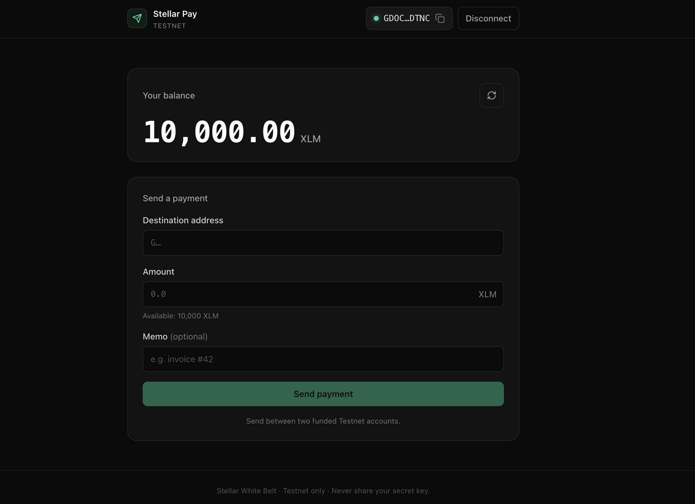
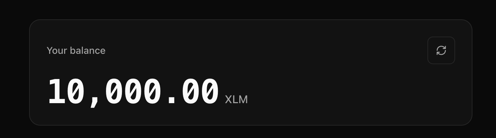
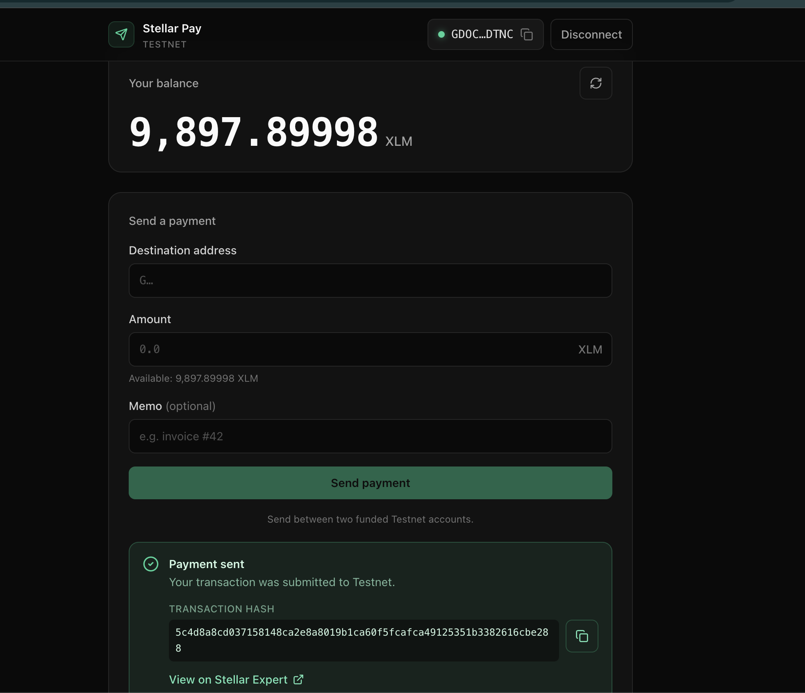

# Stellar Pay — White Belt Payment dApp

A small, production-quality frontend dApp for sending **XLM on the Stellar Testnet**. It connects the [Freighter](https://www.freighter.app/) browser wallet, shows your account's native XLM balance, and lets you send a payment with clear success/failure feedback and a link to the transaction on a block explorer. This is the **White Belt (Level 1)** submission for the Stellar *Journey to Mastery* program — the scope is intentionally small, with clean architecture, correctness, and error handling as the focus.

> **Testnet only.** This app never touches mainnet, and your secret key never leaves the Freighter extension.

## Features

Mapped to the Level 1 requirements:

- **Connect & disconnect** the Freighter wallet (Stellar Testnet only).
- **View balance** — fetches and clearly displays the account's native XLM balance, with a refresh control.
- **Fund new accounts** — unfunded Testnet accounts get a one-click **Friendbot** funding path.
- **Send XLM payments** — destination + amount form with inline validation (valid `G…` address, amount greater than zero and within your spendable balance), plus an optional memo.
- **Transaction feedback** — a success state shows the transaction hash with a link to view it on Stellar Expert; failures show a specific, friendly message.
- **Robust error handling** across wallet, network, balance, and transaction flows — including a network guard that blocks sending when Freighter isn't on Testnet.

## Tech stack

- **[Vite](https://vite.dev/)** — build tooling and dev server
- **React + TypeScript** (strict mode) — client-only SPA, no SSR
- **[Tailwind CSS](https://tailwindcss.com/)** — dark, responsive UI
- **[@stellar/stellar-sdk](https://github.com/stellar/js-stellar-sdk)** — Horizon queries and transaction building
- **[@stellar/freighter-api](https://github.com/stellar/freighter)** — wallet connection and signing
- **ESLint + Prettier** — linting and formatting

## Prerequisites

- **Node.js 20.19+ or 22.12+** (required by Vite 8) and npm.
- The **[Freighter browser extension](https://www.freighter.app/)** installed.
- Freighter switched to the **Testnet** network (the app shows a warning banner if it isn't).
- A **funded Testnet account**. You can fund one with the in-app **Fund with Friendbot** button, or directly via [https://friendbot.stellar.org](https://friendbot.stellar.org/?addr=YOUR_PUBLIC_KEY).

## Setup / run locally

No secrets or API keys are required — the app is Testnet-only and reads non-secret configuration from `VITE_`-prefixed environment variables.

```bash
# 1. Clone the repository
git clone <repository-url>
cd stellar-white-belt-dapp

# 2. Install dependencies
npm install

# 3. Create your local env file (defaults already point at Testnet)
cp .env.example .env

# 4. Start the dev server
npm run dev
```

Then open the printed URL (default **http://localhost:5173**).

**Available scripts:**

| Command | Description |
| --- | --- |
| `npm run dev` | Start the Vite dev server |
| `npm run build` | Type-check and build for production |
| `npm run preview` | Preview the production build locally |
| `npm run lint` | Run ESLint |
| `npm run format` | Format the codebase with Prettier |

## How to use

1. Click **Connect Freighter** (top right) and approve the connection in the extension.
2. Make sure Freighter is on **Testnet** — a banner blocks sending if it isn't.
3. Your XLM balance appears. If the account is new/unfunded, click **Fund with Friendbot** to receive 10,000 test XLM.
4. In **Send a payment**, enter a **destination** (another funded Testnet `G…` address) and an **amount** in XLM (an optional memo is supported).
5. Click **Send payment** and approve the signature request in Freighter.
6. On success, copy the **transaction hash** and open it on **Stellar Expert** via the provided link.

> Payments are sent between two **funded** Testnet accounts. Sending to an account that doesn't exist yet will fail — fund the destination first (Friendbot) if needed.

## Screenshots

| | |
| --- | --- |
| **Wallet connected** | **Balance displayed** |
|  |  |
| **Successful transaction** | **Transaction result** |
|  |  |

## Project structure

```
src/
├── components/      # Presentational UI: Header, WalletButton, NetworkBanner,
│                    # BalanceCard, PaymentForm, TxStatus, Toast, icons
├── context/         # React providers: WalletContext, ToastContext
├── hooks/           # Reusable hooks: useBalance, useToast
├── lib/             # Framework-agnostic services (no React):
│                    # freighter, stellar, friendbot, validation
├── types/           # Shared TypeScript types
├── config.ts        # Env + constants (Testnet only)
├── App.tsx          # Layout composition
├── main.tsx         # Entry point + providers
└── index.css        # Tailwind directives + dark base theme
```

The `src/lib/` services are pure and framework-agnostic; React state lives in `context/` and `hooks/`; components never call Freighter or Horizon directly — only through these layers.

## Notes

- **Testnet only.** There is no mainnet configuration, by design.
- **Your keys stay in Freighter.** The app never requests, stores, or logs private keys or secrets — signing happens entirely inside the extension.
- **No secrets in the repo.** `.env` is gitignored; only non-secret `VITE_`-prefixed values (Horizon, Friendbot, and explorer URLs) ship to the client, with Testnet defaults baked in.
