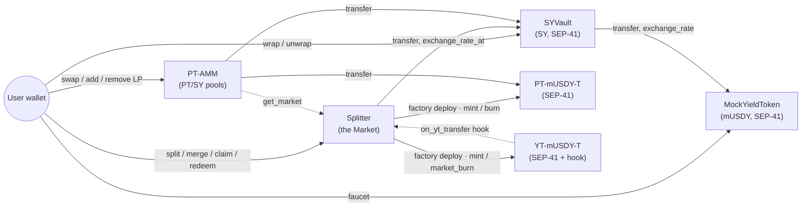
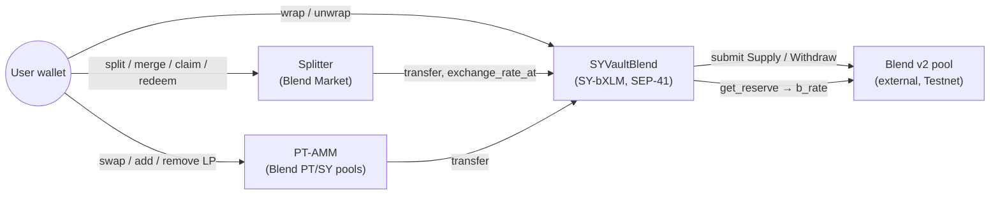

# Architecture

The contracts, how they call each other, the two yield sources behind the same
interface, and the accounting that makes tokenized PT/YT safe.

Deployed addresses and verifiable transactions are in the
[README](../README.md#deployed-on-testnet).

## The contracts

Everspan is six core Soroban contracts (seven with the Blend vault) plus a factory-deployed
PT/YT token pair per maturity — inter-contract communication is intrinsic to the design, not
bolted on:

1. **MockYieldToken (mUSDY)** — a demo yield-bearing token (simulating USDY / a Blend position).
   Balances are fixed; an **exchange rate grows with ledger time** (~5% APY by default),
   checkpointed so any past rate is recoverable exactly. Full SEP-41 + a public faucet.
2. **SYVault** — wraps mUSDY into **Standardized Yield (SY)** 1:1. SY is a full SEP-41 token
   (`SY-mUSDY`: transfer, allowances, burn, metadata), so the Market — and any future
   contract — moves it like any other token. Delegates its exchange rate to mUSDY.
3. **Splitter (the Market)** — for a chosen maturity `T`: `split(SY) → PT + YT`,
   `merge(PT+YT) → SY`, `claim_yield(YT) → accrued yield`, `redeem_pt(PT) → fixed principal`
   at/after maturity. `create_maturity` **factory-deploys** that maturity's token pair:
4. **PT Token / YT Token** (`PT-mUSDY-<T>` / `YT-mUSDY-<T>`) — real, transferable SEP-41
   tokens, minted only by the Market; the YT carries the settlement hook described below.
5. **PT-AMM** — constant-product PT/SY pools (one per maturity, 30 bps LP fee, Uniswap-V2
   math with the first-mint MINIMUM_LIQUIDITY lock). **This is where the fixed rate becomes
   real:** PT trades at a discount, so buying PT = locking
   `(1/cost)^(YEAR/Δt) − 1` APY until maturity. Swaps and deposits freeze at maturity;
   LP withdrawal always works.
6. **SYVaultBlend** — the same SY interface over a **real [Blend](https://blend.capital) lending
   position** instead of the mock. See [Two markets](#two-markets-mock-and-real-yield) below: the
   SY interface *is* the adapter boundary, so the Market and the AMM run over it unchanged.

## Inter-contract call inventory

| # | Caller → Callee | Call | When |
|---|---|---|---|
| 1 | SYVault → MockYieldToken | `transfer` (user → vault) | `wrap` |
| 2 | SYVault → MockYieldToken | `transfer` (vault → user) | `unwrap` |
| 3 | SYVault → MockYieldToken | `exchange_rate` / `exchange_rate_at` | rate views |
| 4 | Splitter → SYVault | `transfer` (user → splitter, nested auth, one signature) | `split` |
| 5 | Splitter → SYVault | `transfer` (splitter → user, invoker auth) | `merge`, `claim_yield`, `redeem_pt` |
| 6 | Splitter → SYVault → MockYieldToken | `exchange_rate_at(min(now, T))` — **two-hop chain** | every settle |
| 7 | Splitter → PT/YT tokens | `deploy_v2` — **factory deploys** the maturity's token pair | `create_maturity` |
| 8 | Splitter → PT/YT tokens | `mint` / `burn` / `market_burn` | `split`, `merge`, `redeem_pt` |
| 9 | YT token → Splitter | `on_yt_transfer` — settlement **callback** with pre-change balances | every YT transfer/burn |
| 10 | PT-AMM → PT & SY tokens | `transfer` (nested auth) | `swap`, `add_liquidity`, `remove_liquidity` |
| 11 | PT-AMM → Splitter | `get_market` — resolve the maturity's PT token | `create_pool` |
| 12 | SYVaultBlend → Blend pool | `submit(Supply)` — the pool pulls the underlying from the *user* (nested auth) | `wrap` |
| 13 | SYVaultBlend → Blend pool | `submit(Withdraw)` — the pool pays the user directly; failures mapped from Blend's codes | `unwrap` |
| 14 | SYVaultBlend → Blend pool | `get_reserve` — the live `b_rate` behind `exchange_rate` | every settle on the Blend market |

## Two markets: mock and real yield

The app ships **two independent markets**, switchable from the toggle above the tabs. They share
no state and no contracts — only the PT/YT wasm:

| | **mUSDY** | **XLM · Blend** |
|---|---|---|
| Yield source | MockYieldToken, a rate that grows ~5% APY by ledger time | a live [Blend v2](https://blend.capital) lending pool on Testnet |
| SY shares | wrapped 1:1 with the underlying | **bTokens** — wrapping mints `amount / rate` shares |
| Getting the underlying | public faucet on the token | Friendbot (it is plain XLM) |
| Purpose | deterministic demo, the CI baseline | proof the mechanism works on yield nobody controls |

Per MASTERPLAN §3.7 there is **no adapter contract**: the SY interface *is* the adapter boundary,
so `SYVaultBlend` simply implements the same surface the Market already consumes
(`transfer / balance / exchange_rate / exchange_rate_at`), and the Market, the PT/YT tokens and the
AMM run over it unchanged. Two things Blend does not provide on its own are added in the vault:

- **Monotonicity.** `exchange_rate` returns Blend's live `b_rate` through a ratchet, so the rate can
  never move backwards. MASTERPLAN §3.2 makes that binding for every SY source, and the settle math
  depends on it.
- **A recoverable past.** Blend keeps no rate history, but maturity settlement needs `R_T`. A past
  timestamp **freezes at the first rate observed after it** and every later lookup returns that same
  value — so the first post-maturity settlement pins `R_T` in the transaction that reads it, and
  every later one agrees. Freezing *upward* is the safe direction: a lookup that came back lower
  than the live read at that moment would make a settlement release negative and quietly shift SY
  to PT holders. The reasoning is written up in `docs/plan/blend-notes.md`.

**Exit can genuinely fail.** A fully utilized Blend reserve cannot pay a withdrawal; the vault
catches the pool's `InvalidUtilRate` and surfaces it as its own error, so the UI says *"the Blend
pool has no free liquidity right now"* instead of a generic failure.

`blend-contract-sdk` is deliberately **not** a dependency: its latest release pins `soroban-sdk 25`
against this workspace's `27`, and two SDK majors cannot share an `Env`. The pool client is
hand-written from the deployed spec, and tests run against a mock pool that reproduces Blend's exact
rounding — which also keeps CI free of network calls.

## Protocol mechanics

**Tokenized PT/YT with user-index accounting.** PT and YT are real SEP-41 tokens — one pair per
maturity, factory-deployed by the Market (`create_maturity` → `deploy_v2` with a deterministic
salt, constructor-wired to the Market as sole minter; symbols `PT-mUSDY-<T>` / `YT-mUSDY-<T>`).
Because YT is transferable, yield is settled per holder against a **rate index** (the Pendle
user-index mechanism):

> Each holder carries `index` — the exchange rate at their last settlement. On settle at effective
> rate `R` (frozen at `R_T` from maturity on), the holder is credited
> `released = floor(yt·S/index) − ceil(yt·S/R)`, clamped ≥ 0, and `index := R`. Entitlements
> floor, retained backing ceils — no settlement can overpay the real released yield.

**The YT settlement hook.** Every user-initiated YT balance change (`transfer`, `transfer_from`,
`burn`, `burn_from`) first calls `Market.on_yt_transfer` with the **pre-change balances as
arguments**, settling both parties — sender keeps the yield accrued up to that moment, receiver
starts earning from it. Balances travel as arguments because Soroban forbids the Market reading
`YT.balance()` back while YT is mid-call (reentrancy ban); authenticity comes from the factory
registry plus `require_auth()`, which only the genuine YT contract passes as direct invoker.
`mint`/`market_burn` are hook-free (the Market settles internally first); `market_burn` demands
both the Market's and the holder's auth so nobody can skip settlement.

**Rounding law.** Every amount that *leaves* the protocol is rounded **down** (floor); every amount
*reserved* against a liability is rounded **up** (ceil). Consequence: the SY the contract holds is
always `≥ Σ reserve_sy + Σ accrued_sy` — there is never mintable dust. A solvency invariant test
asserts exactly this after every operation in a scripted lifecycle.

**Invariants** (enforced + tested):
- `PT_supply == YT_supply` for a maturity, through all pre-maturity operations.
- `split` then immediate `merge` of *n* SY returns *n* minus at most 2 stroops (one floor each way).
- YT stops accruing exactly at maturity; PT then redeems its fixed principal at the frozen maturity
  rate. (Post-maturity, `redeem` burns PT while YT stays inert — the `PT == YT` equality is a
  *pre-maturity* invariant, by design.)
